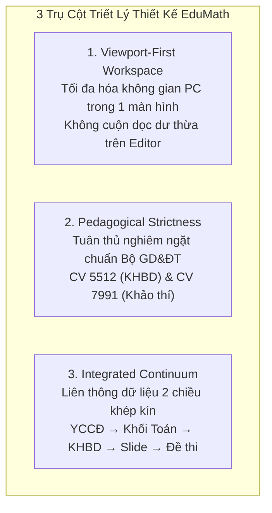
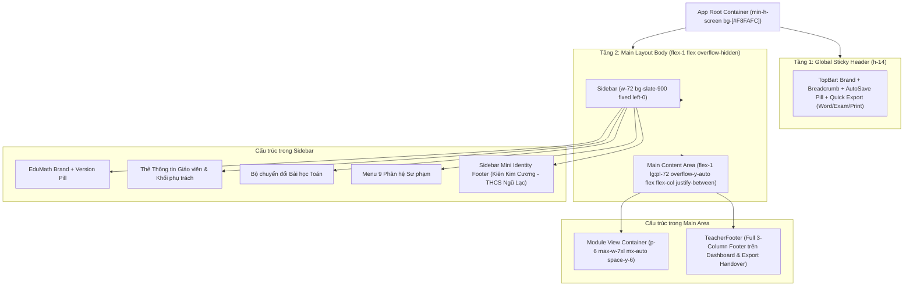
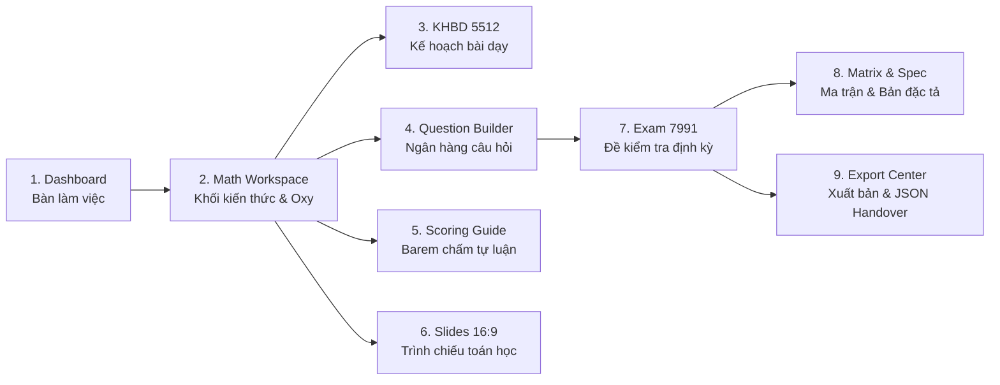
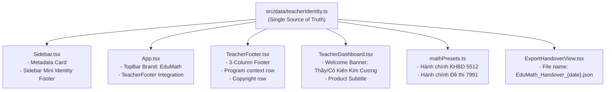

# TÀI LIỆU THIẾT KẾ BỐ CỤC UI/UX DESIGN TOÀN HỆ THỐNG
## EDUMATH — MATHEMATICS TEACHING WORKSPACE
### KHÔNG GIAN SƯ PHẠM SỐ TOÁN THCS & THPT CHUẨN CÔNG VĂN 5512 VÀ 7991

---

## 1. TỔNG QUAN THIẾT KẾ & ĐỊNH VỊ SẢN PHẨM

### 1.1. Thông tin Định danh & Bối cảnh Sản phẩm
* **Tên sản phẩm**: **EduMath**
* **Tên phụ đề / Mô tả ngắn**: *Mathematics Teaching Workspace*
* **Mục đích**: Hỗ trợ giáo viên xây dựng kế hoạch bài dạy (KHBD), slide bài giảng trực quan, ngân hàng câu hỏi khảo thí, ma trận - bản đặc tả, đề kiểm tra định kỳ và barem chấm môn Toán.
* **Tác giả thực hiện**: **Kiên Kim Cương**
  - Chức vụ: Giáo viên Toán
  - Tổ chuyên môn: Tổ Toán - Tin học
  - Bộ môn: Toán
  - Đơn vị công tác: **Trường THCS Ngũ Lạc**
  - Cấp học: THCS
  - Địa phương: **Tỉnh Vĩnh Long**
  - Kênh liên hệ: [`kienkimcuong@gmail.com`](mailto:kienkimcuong@gmail.com)
* **Bối cảnh xây dựng**: 
  - *Chương trình chuyển giao kỹ thuật ứng dụng trí tuệ nhân tạo (AI) trong giáo dục dành cho cán bộ quản lý và giáo viên cấp THCS – THPT tỉnh Vĩnh Long*
  - Thời gian tổ chức: **03–04/10/2026**

---

### 1.2. Triết lý Thiết kế Cốt lõi (Design Philosophy)



1. **Viewport-First Architecture (Ưu tiên không gian hiển thị màn hình PC)**:
   - Giáo viên khi soạn bài, vẽ đồ thị hoặc xây dựng ma trận đề thi cần tập trung tối đa mà không bị xao nhãng bởi việc cuộn trang liên tục.
   - Do đó, các màn hình biên soạn chính (*Math Workspace, KHBD Builder, Slide Builder, Question Builder, Exam Builder, Matrix*) được tối ưu hóa hiển thị trong khung nhìn chuẩn (Viewport-First).
   - Chân trang toàn phần (*TeacherFooter*) được phân bổ hiển thị trang trọng tại *Bàn làm việc (Dashboard)* và *Trung tâm xuất bản (Export Center)*, trong khi các màn hình biên tập sử dụng *Sidebar Mini Identity* để giữ trọn 100% diện tích làm việc.

2. **Pedagogical Strictness (Chuẩn mực Nghiệp vụ Sư phạm Toán học)**:
   - Tích hợp bộ kết xuất công thức toán học **KaTeX** thời gian thực, hỗ trợ các ký hiệu đại số, giải tích, hình học chuẩn mực ($\LaTeX$).
   - Trực quan hóa mặt phẳng tọa độ Oxy và đồ thị hàm số bằng SVG vector tương tác trực tiếp.
   - Chuẩn hóa cấu trúc 4 hoạt động và 4 bước dạy học theo **Công văn 5512/BGDĐT-GDTrH**.
   - Chuẩn hóa cấu trúc đề kiểm tra 4 phần và ma trận 2 chiều theo **Công văn 7991/BGDĐT-GDTrH** (ngày 17/12/2024).

3. **Distraction-Free & Modern Aesthetics (Thẩm mỹ Hiện đại, Tinh giản)**:
   - Giao diện sử dụng hệ màu trung tính cao cấp: Nền sáng dịu `#F8FAFC`, bề mặt thẻ `#FFFFFF`, thanh điều hướng tối sang trọng `#0F172A`, điểm nhấn màu xanh Toán học Blue-600 (`#2563EB`).
   - Kiểu chữ chuẩn mực tiếng Việt **Be Vietnam Pro**.
   - Không lạm dụng hiệu ứng đổ bóng lớn, không viền rực rỡ, không icon trang trí thừa thãi.

---

## 2. HỆ THỐNG QUY CHUẨN THIẾT KẾ TOÀN CỤC (DESIGN SYSTEM & TOKENS)

### 2.1. Bảng màu Sư phạm (Color Palette)

| Mã màu / Token Tailwind | Giá trị Hex | Ứng dụng trong Giao diện |
| :--- | :--- | :--- |
| **Slate-950 / Slate-900** | `#020617` / `#0F172A` | Nền Sidebar điều hướng, Topbar dark context, Footer dark accent |
| **Slate-800 / Slate-700** | `#1E293B` / `#334155` | Đường viền Sidebar, thẻ Metadata Giáo viên trong Sidebar |
| **Canvas Background** | `#F8FAFC` | Nền toàn bộ vùng làm việc chính (Main Content Area) |
| **Card Surface** | `#FFFFFF` | Bề mặt các thẻ chức năng, bảng biểu, khung soạn thảo giáo án |
| **Border Neutral** | `#E2E8F0` / `#CBD5E1` | Đường viền các panel, bảng ma trận, phân cách phần đề thi |
| **Primary Blue (Toán học)** | `#2563EB` (Blue-600) | Nút bấm chính, tab đang kích hoạt, điểm nhấn công thức toán |
| **Primary Blue Light** | `#EFF6FF` (Blue-50) | Nền badge trạng thái, thẻ bài tập được chọn, highlight |
| **Emerald (Thành công / NB)** | `#059669` (Emerald-600) | Trạng thái Đã lưu, mức độ Nhận biết, ý Đúng trong câu Đúng/Sai |
| **Amber (Cảnh báo / TH)** | `#D97706` (Amber-600) | Mức độ Thông hiểu, lưu ý phương pháp sư phạm, ghi chú giáo viên |
| **Violet / Indigo (Vận dụng)** | `#7C3AED` / `#4F46E5` | Mức độ Vận dụng, bài toán thực tế, liên môn |
| **Rose (Lỗi / Sai)** | `#E11D48` (Rose-600) | Ý Sai trong câu Đúng/Sai, nút Xóa, cảnh báo vượt thang điểm |

---

### 2.2. Quy chuẩn Typography (Be Vietnam Pro)

Toàn bộ hệ thống sử dụng kiểu chữ **Be Vietnam Pro** với các cấp bậc thị giác chặt chẽ:

```text
[Display / App Brand]  : 16–18px · SemiBold (600) · Tracking -0.01em
[Page Title / Module]  : 20–24px · Bold (700) · Leading Tight
[Section Header / H2]  : 14–16px · SemiBold (600) · Uppercase Tracking 0.05em
[Card Title / H3]      : 14–15px · SemiBold (600)
[Body Text / Math Flow]: 13–14px · Regular (400) · Leading 1.5–1.6
[Microcopy / Badges]   : 10–12px · Medium (500) / SemiBold (600)
[Math Formula Display] : KaTeX Engine (Computer Modern Math Font)
```

---

### 2.3. Hệ thống Lưới & Khoảng cách (Spacing & Layout Grid)

* **Hệ thống bước 8pt**: Tất cả padding, margin, gap tuân theo bội số `4px`, `8px`, `12px`, `16px`, `20px`, `24px`, `32px`.
* **Kích thước thành phần chuẩn**:
  - TopBar Height: `56px` cố định trên đỉnh màn hình (`sticky top-0`).
  - Sidebar Width: `288px` (`w-72`) cố định bên trái trên Desktop (`fixed inset-y-0 left-0`).
  - Main Area Padding: `p-4` (Mobile), `p-6` (Tablet), `p-8` (Desktop).
  - Vùng chứa nội dung tối đa: `max-w-7xl mx-auto` (khoảng 1280px).
* **Bo góc (Border Radius)**:
  - Thẻ lớn / Banner: `rounded-3xl` (24px)
  - Khung nội dung / Dialog: `rounded-2xl` (16px)
  - Nút bấm / Input / Badge: `rounded-xl` (12px) hoặc `rounded-lg` (8px).

---

## 3. KIẾN TRÚC KHUNG VỎ ỨNG DỤNG (GLOBAL APP SHELL)

### 3.1. Sơ đồ Cấu trúc Phân tầng



---

### 3.2. Thanh Điều hướng Đỉnh Toàn cục (Sticky TopBar)

* **Vị trí**: `sticky top-0 z-30` với hiệu ứng kính mờ `bg-white/95 backdrop-blur-md border-b border-slate-200`.
* **Cụm Trái (Brand & Cấp học)**:
  - Nút đóng/mở Sidebar trên Mobile (`lg:hidden`).
  - Icon Toán học `Calculator` trong khung xanh vuông bo góc (`bg-blue-600 text-white`).
  - Nhãn thương hiệu: **EduMath**.
  - Huy hiệu khối lớp: `Lớp 9` (`bg-blue-50 text-blue-800 border-blue-200`).
* **Cụm Giữa (Breadcrumb Ngữ cảnh)**:
  - Hiển thị cấu trúc bài dạy: `Toán 9 / Chương I / Bài 1: Khái niệm phương trình và hệ hai phương trình bậc nhất hai ẩn`.
  - Tự động cắt ngắn (`truncate`) nếu tên bài dài trên màn hình trung bình.
* **Cụm Phải (Trạng thái & Thao tác nhanh)**:
  - Chỉ báo tự động lưu: `Đã lưu (v2.0-MATH)` với đèn nháy xanh lá `animate-pulse`.
  - Nút **Word 5512**: Xuất nhanh file Word giáo án KHBD 5512.
  - Nút **Đề 7991**: Xuất nhanh file Word đề thi định kỳ.
  - Nút **In A4**: Mở hộp thoại in ấn chuẩn trình duyệt (tự động kích hoạt `@media print`).

---

### 3.3. Thanh Điều hướng Dọc (Fixed Sidebar)

Thanh Sidebar đóng vai trò xương sống điều hướng sư phạm, với tông nền tối sang trọng `#0F172A`:

1. **Brand Header**:
   - Logo EduMath v2.0 kèm phụ đề: *Mathematics Teaching Workspace*.
2. **Teacher Metadata Card (Thẻ Giáo viên)**:
   - Hiển thị trực tiếp:
     - Giáo viên: **Kiên Kim Cương**
     - Đơn vị: **Trường THCS Ngũ Lạc**
     - Khối phụ trách: **Lớp 9 (9A1, 9A2)**
3. **Lesson Switcher (Bộ chọn Bài dạy)**:
   - Danh sách bài dạy đang có trong hệ thống kèm trạng thái active, cho phép chuyển đổi bài dạy ngay lập tức.
4. **Navigation Menu (9 Phân hệ Sư phạm)**:
   - Menu gồm 9 mục đánh số thứ tự từ 1 đến 9 tương ứng quy trình chuẩn bị và thực hiện giảng dạy.
   - Trạng thái Active: Nền xanh `bg-blue-600 text-white font-semibold shadow-sm`.
   - Trạng thái Normal: Chữ xám nhạt `text-slate-300 hover:bg-slate-800 hover:text-white`.
5. **Sidebar Mini Identity (Chân Sidebar - Mục 20)**:
   - Hiển thị cố định ở chân Sidebar trên mọi màn hình:
     ```text
     ┌────────────────────────────────────────────────────────┐
     │ Kiên Kim Cương                                ● Online │
     │ Giáo viên Toán · Tổ Toán - Tin học                     │
     │ Trường THCS Ngũ Lạc · Vĩnh Long                        │
     │ [Mail] kienkimcuong@gmail.com                          │
     └────────────────────────────────────────────────────────┘
     ```
   - Cho phép click mở trình soạn thư `mailto:kienkimcuong@gmail.com`.
   - Giúp người chấm và người dùng luôn nhận biết được tác giả bài dạy dù đang làm việc ở bất kỳ phân hệ nào.

---

### 3.4. Chân trang Toàn phần (TeacherFooter Component)

Tuân thủ nguyên tắc **Viewport-First (Mục 19 & 21)**, chân trang đầy đủ xuất hiện tại màn hình **Bàn làm việc (Dashboard)** và **Trung tâm Xuất bản (Export Center)**.

#### Bố cục Desktop (3 Cột)
```text
┌──────────────────────┬────────────────────────────┬────────────────────────────┐
│ Nhóm 1: Sản phẩm     │ Nhóm 2: Người thực hiện    │ Nhóm 3: Liên hệ            │
│                      │                            │                            │
│ EduMath              │ Thực hiện bởi              │ Liên hệ                    │
│ Mathematics          │ Kiên Kim Cương             │ [Mail] kienkimcuong@gmail..│
│ Teaching Workspace   │ Giáo viên Toán             │ (clickable mailto link)    │
│                      │ Tổ Toán - Tin học          │                            │
│                      │ Trường THCS Ngũ Lạc        │                            │
│                      │ Vĩnh Long                  │                            │
└──────────────────────┴────────────────────────────┴────────────────────────────┘

Sản phẩm thực hiện trong Chương trình chuyển giao kỹ thuật ứng dụng trí tuệ nhân tạo (AI)
trong giáo dục dành cho cán bộ quản lý và giáo viên cấp THCS – THPT tỉnh Vĩnh Long · 03–04/10/2026

© 2026 Kiên Kim Cương · EduMath. All rights reserved.
```

#### Bố cục Mobile (Xếp chồng Dọc)
- Chuyển thành dạng 1 cột cân đối, căn giữa hoặc căn trái tự nhiên.
- Email tự động co giãn không bị tràn ngang (`truncate`).
- Khoảng cách padding `px-4 py-5`, chiều cao nhỏ gọn dưới 180px.
- Tự động ẩn khi xuất bản in ấn (`print:hidden`).

---

## 4. CHI TIẾT BỐ CỤC 9 PHÂN HỆ SƯ PHẠM (9 MODULES UI/UX)



---

### 4.1. Phân hệ 1: Bàn Làm Việc Giáo Viên (`TeacherDashboard`)

* **Mục tiêu UX**: Cung cấp cái nhìn bao quát toàn bộ tiến trình giảng dạy, hồ sơ sư phạm và truy cập nhanh 1-chạm vào các tác vụ thường ngày.
* **Cấu trúc Bố cục**:
  1. **Hero Welcome Banner**:
     - Nền gradient cao cấp `slate-900` qua `blue-950` tạo chiều sâu chuyên nghiệp.
     - Lời chào cá nhân hóa: `Xin chào Thầy/Cô Kiên Kim Cương`.
     - Phụ đề sư phạm: *Không gian làm việc số tích hợp cho giáo viên Toán: kết nối liên thông từ Yêu cầu cần đạt $\rightarrow$ Kiến thức & Đồ thị $\rightarrow$ KHBD 5512 $\rightarrow$ Slide giảng dạy $\rightarrow$ Đề kiểm tra & Ma trận 7991.*
     - 3 chip metadata: `Trường: THCS Ngũ Lạc`, `Khối: Lớp 9 (9A1, 9A2)`, `Năm học: 2025 - 2026 (Học kỳ I)`.
  2. **Resume Spotlight Card (Công việc Đang Thực Hiện)**:
     - Nằm ngay dưới banner chào mừng, hiển thị bài dạy đang soạn dở cùng thời gian chỉnh sửa mới nhất.
     - 4 nút tắt truy cập ngay: Soạn bài, Xem KHBD, Biên tập Slide, Xây dựng đề thi.
  3. **Lưới Hành Động Nhanh (Quick Actions Grid - 5 Thẻ)**:
     - Thẻ 1 (Blue): *Soạn bài & Khối Kiến thức* $\rightarrow$ Chuyển sang Math Workspace.
     - Thẻ 2 (Indigo): *Thiết kế KHBD 5512* $\rightarrow$ Chuyển sang KhbdView.
     - Thẻ 3 (Emerald): *Ngân hàng Câu hỏi Toán* $\rightarrow$ Chuyển sang QuestionBuilderView.
     - Thẻ 4 (Violet): *Khảo thí & Đề thi 7991* $\rightarrow$ Chuyển sang Exam7991View.
     - Thẻ 5 (Amber): *Slide Bài giảng Storytelling* $\rightarrow$ Chuyển sang SlidesView.
  4. **Thống kê Hồ sơ Sư phạm & Bảng Tuân thủ Pháp lý**:
     - Hiển thị tiến độ hoàn thành các chỉ tiêu Công văn 5512 và Công văn 7991.

---

### 4.2. Phân hệ 2: Không Gian Bài Dạy Toán (`MathWorkspace`)

* **Mục tiêu UX**: Không gian làm việc hạt nhân nơi giáo viên xây dựng các khối kiến thức toán học, công thức đại số $\LaTeX$, đồ thị mặt phẳng tọa độ Oxy và các bài toán tình huống thực tế.
* **Cấu trúc Bố cục**:
  1. **Thanh Thao tác Nhanh (Block Toolbars)**:
     - Bộ nút bấm thêm nhanh khối: `+ Khái niệm`, `+ Định lý / Tính chất`, `+ Công thức KaTeX`, `+ Đồ thị Oxy`, `+ Lời giải từng bước`, `+ Bài tập vận dụng`.
  2. **Danh sách Khối Kiến thức (Knowledge Blocks List)**:
     - Mỗi khối là một Card độc lập với header phân loại màu riêng biệt.
     - Tích hợp trình soạn thảo nội dung + công thức LaTeX song song.
     - **Trực quan hóa Đồ thị Oxy (Interactive SVG Oxy Coordinate System)**:
       - Vẽ trục tọa độ hoành $Ox$, tung $Oy$, lưới tọa độ số học, mũi tên định hướng và gốc tọa độ $O$.
       - Biểu diễn trực quan tập nghiệm của phương trình đường thẳng bậc nhất hai ẩn $ax + by = c$.
       - Biểu diễn giao điểm nghiệm của hệ hai phương trình bậc nhất hai ẩn.
  3. **Hành động Liên thông (Cross-module Action Bar)**:
     - Nút `Tạo Slide từ khối này`: Đẩy trực tiếp kiến thức sang hệ thống Slide.
     - Nút `Tạo Câu hỏi trắc nghiệm`: Đẩy trực tiếp bài toán vào Ngân hàng câu hỏi.

---

### 4.3. Phân hệ 3: Kế Hoạch Bài Dạy Chuẩn 5512 (`KhbdView`)

* **Mục tiêu UX**: Trình bày và biên tập giáo án đúng mẫu biểu phụ lục kèm theo Công văn số 5512/BGDĐT-GDTrH của Bộ Giáo dục và Đào tạo.
* **Cấu trúc Bố cục**:
  1. **Khung Thông tin Hành chính (Header Quốc gia)**:
     - Trường: **Trường THCS Ngũ Lạc** | Tổ chuyên môn: **Tổ Toán - Tin học**.
     - Giáo viên thực hiện: **Kiên Kim Cương**.
     - Tên bài: **BÀI 1: KHÁI NIỆM PHƯƠNG TRÌNH VÀ HỆ HAI PHƯƠNG TRÌNH BẬC NHẤT HAI ẨN**.
  2. **Mục I. Mục Tiêu Dạy Học**:
     - *1. Về kiến thức*: Nắm vững định nghĩa phương trình, hệ phương trình, nghiệm và biểu diễn hình học.
     - *2. Về năng lực*: Năng lực tư duy và lập luận toán học, năng lực mô hình hóa toán học, năng lực giải quyết vấn đề toán học.
     - *3. Về phẩm chất*: Chăm chỉ, trung thực, trách nhiệm.
  3. **Mục II. Thiết Bị Dạy Học & Học Liệu**:
     - Phấn màu, thước kẻ chia độ, phần mềm GeoGebra/EduMath trình chiếu Oxy, phiếu học tập số 1, 2, 3.
  4. **Mục III. Tiến Trình Dạy Học (4 Hoạt Động Chuẩn)**:
     - *Hoạt động 1: Mở đầu (Khởi động)* — Tình huống bài toán cổ Quýt Cam.
     - *Hoạt động 2: Hình thành kiến thức mới* — Khái niệm phương trình bậc nhất hai ẩn và hệ hai phương trình.
     - *Hoạt động 3: Luyện tập* — Nhận biết phương trình và kiểm tra nghiệm cặp số $(x_0; y_0)$.
     - *Hoạt động 4: Vận dụng* — Lập hệ phương trình giải quyết bài toán thực tế.
  5. **Bảng Tổ chức 4 Bước Dạy Học**:
     - Mỗi hoạt động được cơ cấu chặt chẽ theo 4 bước:
       - *Bước 1: Chuyển giao nhiệm vụ học tập*
       - *Bước 2: Thực hiện nhiệm vụ học tập*
       - *Bước 3: Báo cáo kết quả và thảo luận*
       - *Bước 4: Đánh giá kết quả, thực hiện nhiệm vụ học tập (Kết luận)*

---

### 4.4. Phân hệ 4: Ngân Hàng Câu Hỏi Toán (`QuestionBuilderView`)

* **Mục tiêu UX**: Phân loại, quản lý và tùy biến ngân hàng câu hỏi khảo thí toán học theo ma trận nhận thức.
* **Cấu trúc Bố cục**:
  1. **Bộ lọc Đa chiều (Filter Matrix Bar)**:
     - Lọc theo định dạng: *Trắc nghiệm 4 lựa chọn*, *Đúng/Sai 4 ý*, *Trả lời ngắn*, *Tự luận*.
     - Lọc theo cấp độ nhận thức: *Nhận biết (NB)*, *Thông hiểu (TH)*, *Vận dụng (VD)*.
     - Lọc theo năng lực: *Tư duy & lập luận*, *Mô hình hóa*, *Giải quyết vấn đề*.
  2. **Thẻ Biên tập Câu hỏi (Question Item Card)**:
     - Nội dung câu hỏi hỗ trợ hiển thị công thức toán học KaTeX.
     - Bảng phương án A, B, C, D có đánh dấu phương án đúng bằng huy hiệu màu xanh.
     - Cột chỉ định điểm số từng câu và liên kết trực tiếp vào Đề thi 7991 (*Phần I, II, III, IV*).

---

### 4.5. Phân hệ 5: Barem Chấm Tự Luận (`SolutionScoringBuilder`)

* **Mục tiêu UX**: Xây dựng thang chấm tự luận chi tiết theo từng bước giải toán, bảo đảm sự công bằng và nhất quán khi chấm thi.
* **Cấu trúc Bố cục**:
  1. **Bảng Barem Bậc Thang (Step-by-step Scoring Table)**:
     - Cột 1: *Bước thực hiện* (VD: Đặt ẩn phụ và điều kiện, Lập phương trình (1), Lập phương trình (2), Giải hệ bằng phương pháp cộng đại số, Kết luận).
     - Cột 2: *Yêu cầu cần đạt / Nội dung giải*.
     - Cột 3: *Thang điểm chi tiết* (chia nhỏ đến 0.25 điểm).
  2. **Khung Cảnh báo Lỗi Sai Thường Gặp (Common Pitfalls)**:
     - Ghi chú các lỗi học sinh hay mắc (quên đặt điều kiện ẩn, biến đổi sai dấu) để giáo viên trừ điểm chính xác theo quy chế.

---

### 4.6. Phân hệ 6: Slide Bài Giảng Trực Quan (`SlidesView`)

* **Mục tiêu UX**: Trình chiếu bài giảng tương tác trên lớp học qua máy chiếu hoặc màn hình tương tác thông minh.
* **Cấu trúc Bố cục**:
  1. **Slide Canvas Chuẩn Tỷ lệ 16:9**:
     - Tiêu đề slide cỡ lớn, phân loại chặng bài dạy (*Khởi động, Khám phá, Luyện tập, Vận dụng*).
     - Bố cục 2 cột cân bằng: Cột trái trình bày văn bản sư phạm / gợi ý suy nghĩ; Cột phải hiển thị công thức KaTeX nổi bật hoặc đồ thị Oxy.
  2. **Thanh Điều hướng Trình chiếu (Presentation Controls)**:
     - Nút Next / Prev slide, chỉ số slide hiện tại `Slide X / Y`.
     - Nút **Toàn màn hình (Fullscreen)**: Tối ưu hoá hiển thị không viền cho giờ dạy trên lớp.
     - Khung ghi chú sư phạm người dạy (**Speaker Notes**) phục vụ giáo viên điều phối tiết học.

---

### 4.7. Phân hệ 7: Đề Kiểm Tra Định Kỳ Chuẩn 7991 (`Exam7991View`)

* **Mục tiêu UX**: Hiển thị đề kiểm tra định kỳ hoàn chỉnh đúng cấu trúc định dạng chuẩn của Bộ GD&ĐT quy định tại Công văn số 7991/BGDĐT-GDTrH.
* **Cấu trúc 4 Phần Đề thi**:

```text
┌────────────────────────────────────────────────────────────────────────┐
│ PHẦN I. CÂU HỎI TRẮC NGHIỆM NHIỀU LỰA CHỌN                            │
│ 12 câu hỏi · Mỗi câu 0.25 điểm · Tổng cộng 3.0 điểm                   │
│ Thí sinh chọn 1 phương án đúng duy nhất trong 4 phương án A, B, C, D  │
├────────────────────────────────────────────────────────────────────────┤
│ PHẦN II. CÂU HỎI TRẮC NGHIỆM ĐÚNG / SAI                                │
│ 4 câu hỏi · Mỗi câu có 4 ý a), b), c), d) · Tổng cộng 4.0 điểm         │
│ Cách tính điểm lũy tiến chuẩn 7991:                                    │
│ • Đúng 1 ý: 0.1 điểm  |  Đúng 2 ý: 0.25 điểm                          │
│ • Đúng 3 ý: 0.5 điểm  |  Đúng 4 ý: 1.0 điểm                           │
├────────────────────────────────────────────────────────────────────────┤
│ PHẦN III. CÂU HỎI TRẮC NGHIỆM TRẢ LỜI NGẮN                            │
│ 3 câu hỏi · Mỗi câu 0.5 điểm · Tổng cộng 1.5 điểm                     │
│ Thí sinh điền kết quả số học vào ô trả lời                            │
├────────────────────────────────────────────────────────────────────────┤
│ PHẦN IV. CÂU HỎI TỰ LUẬN TÍCH HỢP                                      │
│ 1 bài toán thực tế · Tổng cộng 1.5 điểm                               │
│ Yêu cầu trình bày lời giải chi tiết, mô hình hóa toán học             │
├────────────────────────────────────────────────────────────────────────┤
│ TỔNG ĐIỂM TOÀN BÀI: 10.0 ĐIỂM (Chuẩn tỷ lệ: 3.0 - 4.0 - 1.5 - 1.5)     │
└────────────────────────────────────────────────────────────────────────┘
```

---

### 4.8. Phân hệ 8: Ma Trận & Bản Đặc Tả Khảo Thí (`MatrixView`)

* **Mục tiêu UX**: Trực quan hóa ma trận 2 chiều và bản đặc tả đề kiểm tra, bảo đảm sự cân đối về tỷ lệ phần trăm giữa các mức độ tư duy.
* **Cấu trúc Bố cục**:
  1. **Bảng Ma Trận 2 Chiều (Two-way Matrix Table)**:
     - Hàng ngang: Các mạch kiến thức (Phương trình bậc nhất hai ẩn, Hệ hai phương trình, Giải bài toán thực tế).
     - Cột dọc: 4 mức độ tư duy *Nhận biết (NB)*, *Thông hiểu (TH)*, *Vận dụng (VD)*, *Vận dụng cao (VDC)*.
     - Tính tổng số câu, tổng số điểm và phần trăm tương ứng:
       - Nhận biết: ~40% (4.0 điểm)
       - Thông hiểu: ~30% (3.0 điểm)
       - Vận dụng & VDC: ~30% (3.0 điểm)
  2. **Bản Đặc Tả Chi Tiết (Specification Table)**:
     - Ghi rõ Yêu cầu cần đạt (YCCĐ) theo chương trình GDPT 2018 tương ứng từng câu hỏi của đề thi.

---

### 4.9. Phân hệ 9: Trung Tâm Xuất Bản & Bàn Giao JSON (`ExportHandoverView`)

* **Mục tiêu UX**: Đóng gói hồ sơ giảng dạy hoàn chỉnh, xuất file tài liệu phục vụ nộp giáo án chuyên môn và sao lưu/phục hồi dữ liệu phiên làm việc không phụ thuộc backend.
* **Cấu trúc Bố cục**:
  1. **Top Banner & Thao tác Sao lưu Dự phòng**:
     - Nút `Tải file JSON dự phòng`: Tải xuống tệp `EduMath_Handover_{YYYY-MM-DD}.json`.
  2. **Checklist Kiểm Tra Chuẩn Sư Phạm (Standards Verification)**:
     - 4 thẻ kiểm tra tự động:
       - $\checkmark$ KHBD chuẩn 4 HĐ Công văn 5512.
       - $\checkmark$ Đề thi 4 phần chuẩn Công văn 7991.
       - $\checkmark$ Ma trận 2 chiều đồng bộ tròn 10.0 điểm.
       - $\checkmark$ JSON State Handover v2.0-MATH hoàn chỉnh.
  3. **Bộ Công Cụ Xuất Bản Văn Phòng (Office Export Suite - 4 Thẻ)**:
     - Thẻ 1: **Xuất Word KHBD 5512** (`.doc` XML tương thích hoàn toàn Microsoft Word).
     - Thẻ 2: **Xuất Word Đề Thi 7991** (kèm ma trận, bản đặc tả và đáp án).
     - Thẻ 3: **Xuất Slide HTML Trình Chiếu** (gói file độc lập mở được trên mọi máy tính).
     - Thẻ 4: **Xuất Hướng Dẫn Chấm & Barem Tự Luận**.
  4. **Khung Nhập & Khôi Phục JSON State**:
     - Khung textarea kèm nút `Khôi phục trạng thái làm việc`: Cho phép dán mã JSON bất kỳ để khôi phục toàn bộ tiến trình sư phạm ngay lập tức.
  5. **Chân trang Toàn phần**:
     - Tích hợp `TeacherFooter` ở chân trang.

---

## 5. MÔ HÌNH DỮ LIỆU TẬP TRUNG (CENTRALIZED DATA ARCHITECTURE)

Hệ thống thiết kế theo kiến trúc dữ liệu tập trung, xóa bỏ hoàn toàn tình trạng hard-code rải rác:

### 5.1. Mô hình Nhận diện Giáo viên (`TeacherIdentity`)
Tệp tin: [`src/data/teacherIdentity.ts`](file:///D:/Workspace/Other/Pj%20AI/HH/src/data/teacherIdentity.ts)
```ts
export interface TeacherIdentity {
  fullName: string;
  subject: string;
  department: string;
  specialization: string;
  school: string;
  schoolLevel: string;
  province: string;
  email: string;
  productName: string;
  productSubtitle: string;
  programName: string;
  programDate: string;
}

export const teacherIdentity: TeacherIdentity = {
  fullName: "Kiên Kim Cương",
  subject: "Toán",
  department: "Tổ Toán - Tin học",
  specialization: "Toán",
  school: "Trường THCS Ngũ Lạc",
  schoolLevel: "THCS",
  province: "Vĩnh Long",
  email: "kienkimcuong@gmail.com",
  productName: "EduMath",
  productSubtitle: "Mathematics Teaching Workspace",
  programName: "Chương trình chuyển giao kỹ thuật ứng dụng trí tuệ nhân tạo (AI) trong giáo dục dành cho cán bộ quản lý và giáo viên cấp THCS – THPT tỉnh Vĩnh Long",
  programDate: "03–04/10/2026"
};
```

### 5.2. Sự Đồng bộ Xuyên suốt Hệ thống



---

## 6. NGUYÊN TẮC RESPONSIVE & KHẢ NĂNG TIẾP CẬN (RESPONSIVE & ACCESSIBILITY)

### 6.1. Khung Kích thước Kiểm thử Chuẩn

| Thiết bị / Độ phân giải | Bố cục Sidebar | Bố cục Footer | Trải nghiệm Thao tác |
| :--- | :--- | :--- | :--- |
| **Desktop 1920×1080** | Cố định `w-72` | 3 cột cân đối, padding `pt-6 pb-5` | Tối ưu Viewport-First hoàn hảo |
| **Laptop 1440×900 / 1366×768** | Cố định `w-72` | 3 cột, gap `gap-6` | Vừa vặn không bị cuộn ngang |
| **Tablet 768×1024** | Ẩn, mở qua Backdrop Drawer | Chuyển lưới linh hoạt 1-2 cột | Thao tác chạm ngón tay thoải mái |
| **Mobile 375×667 - 430×932** | Drawer trượt từ trái sang | 1 cột dọc xếp chồng, email truncate | Gọn gàng, không tràn mép màn hình |

### 6.2. Tiêu chuẩn Trợ năng (Accessibility - A11y)
1. **Focus Rings**: Mọi nút bấm, trường nhập liệu và liên kết email (`mailto:`) đều có viền nét rõ nét khi sử dụng phím Tab (`focus:ring-2 focus:ring-blue-500 focus:ring-offset-2`).
2. **Accessible Labels**: Tất cả các icon tương tác đều được gắn `aria-label` hoặc thẻ ẩn danh cho trình đọc màn hình.
3. **Contrast Ratio**: Độ tương phản chữ chính `#0F172A` trên nền `#FFFFFF` đạt tỷ lệ `14.5:1`, vượt xa tiêu chuẩn WCAG AAA.
4. **Print Optimization**: Sử dụng các lớp `print:hidden` trên thanh TopBar, Sidebar, Footer khi bấm In A4 để tài liệu in ra thuần túy là văn bản giáo án/đề thi đạt chuẩn nộp ban giám hiệu.

---

## 7. TỔNG KẾT & DANH MỤC TÀI LIỆU KÈM THEO

Bố cục UI/UX của **EduMath** đã giải quyết triệt để bài toán:
- Vừa là một công cụ sư phạm chuyên nghiệp, chính xác tuyệt đối theo hai quy chuẩn pháp lý **Công văn 5512** và **Công văn 7991**;
- Vừa khẳng định minh bạch, trang trọng danh tính người thực hiện (**Thầy Kiên Kim Cương – Trường THCS Ngũ Lạc, Vĩnh Long**) và bối cảnh chương trình chuyển giao kỹ thuật ứng dụng AI tại tỉnh Vĩnh Long;
- Vừa giữ được sự tinh tế, thanh thoát, không chiếm dụng không gian làm việc của giáo viên theo đúng triết lý **Viewport-First**.

---
*Tài liệu được khởi tạo và lưu trữ chính thức tại thư mục: `docs/THIET_KE_BO_CUC_UI_UX_EDUMATH.md`.*
