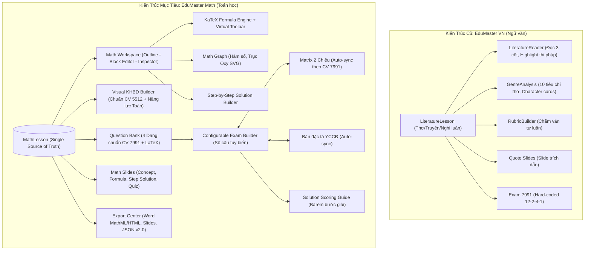

# BÁO CÁO THẨM ĐỊNH KIẾN TRÚC & KẾ HOẠCH CHUYỂN ĐỔI TOÀN DIỆN
# TỪ EDUMASTER VN (NGỮ VĂN) SANG EDUMASTER MATH (TOÁN THCS–THPT)

> **Căn cứ thực hiện:**
> 1. Chỉ đạo thiết kế & yêu cầu kỹ thuật: `docs/promt.md`
> 2. Công văn số 5512/BGDĐT-GDTrH (ngày 18/12/2020) và Khung kế hoạch bài dạy: `docs/5512_BGDDT-GDTrH_462988.md`
> 3. Công văn số 7991/BGDĐT-GDTrH (ngày 17/12/2024) và Phụ lục Ma trận, Bản đặc tả: `docs/7991_BGDDT-GDTrH_636462.md`
> 4. Giáo án thực tế mẫu môn Toán 9: `docs/Tuan 1-2.docx` (Chương I: Phương trình và hệ hai phương trình bậc nhất hai ẩn - Bài 1: Khái niệm phương trình và hệ hai phương trình bậc nhất hai ẩn)
> 5. Hiện trạng source code dự án: Thư mục `src/`, `package.json`, `index.html`.

---

## 1. SOURCE CODE AUDIT (KIỂM TOÁN HIỆN TRẠNG MÃ NGUỒN)

### 1.1. Tầng Cấu hình & Gói phụ thuộc (`package.json`, `index.html`, `vite.config.ts`)
- **Framework & Libraries hiện có:**
  - `react`: `^19.0.1`, `react-dom`: `^19.0.1` (React 19 hiện đại).
  - `vite`: `^8.3.0`, `@vitejs/plugin-react`: `^6.1.1` (Bundler tốc độ cao).
  - `tailwindcss`: `^4.3.3`, `@tailwindcss/vite`: `^4.3.3` (Tailwind v4 mới nhất).
  - `lucide-react`: `^0.546.0` (Hệ thống icon SVG chất lượng cao).
  - `motion`: `^12.23.24` (Hỗ trợ animation mượt mà).
  - `@google/genai`: `^2.4.0` (SDK AI Gemini).
- **Điểm khuyết thiếu công nghệ cho môn Toán:**
  - *Chưa có thư viện KaTeX / MathJax* (`katex`, `@types/katex`): Đang thiếu công cụ phân tích và render ký hiệu/công thức toán học ($\LaTeX$).
  - *Chưa có thư viện PptxGenJS* (`pptxgenjs`): Module xuất PowerPoint hiện tại mới chỉ xuất HTML slide giả lập.
  - *Font chữ tại `index.html`*: Đang nạp font `Lora` (chuyên biệt cho văn học), thiếu font chuẩn KaTeX Math.

### 1.2. Tầng Quản lý Trạng thái (`src/types/index.ts`, `src/App.tsx`, `src/data/`)
- **Tập trung hóa (`AppState`)**: Đang quản lý tập trung qua `useState<AppState>(initialAppState)` tại `src/App.tsx`.
- **Sự phụ thuộc đặc thù môn Ngữ văn**:
  - `ActiveModule` chứa 10 module, trong đó có: `'workspace'`, `'genre_analysis'`, `'rubric'`.
  - Toàn bộ thực thể bài học được định nghĩa bằng `LiteratureLesson` (gồm `author`, `authorBio`, `historicalContext`, `genre: 'poetry' | 'story' | 'argumentative'`, `poetryAnalysis`, `storyAnalysis`, `argumentMap`, `annotations`).
  - Hệ thống câu hỏi (`LiteratureQuestionItem`) gắn chặt với `doc_hieu`, `tieng_viet`, `nl_xa_hoi`, `nl_van_hoc`.
  - Hệ thống Rubric (`RubricData`) phục vụ chấm cảm thụ, bố cục, dẫn chứng văn chương.
  - Dữ liệu Preset (`literaturePresets.ts`): Cung cấp 3 bài văn học mẫu (*Tây Tiến*, *Vợ nhặt*, *Tuyên ngôn Độc lập*).

### 1.3. Tầng Giao diện & Thành phần (`src/components/`)
- `TeacherDashboard.tsx`: Dashboard văn học, hiển thị "Cô Trầm Thị Đổi", lớp "12 Văn", các nút Quick Action định hướng Ngữ văn.
- `LiteratureWorkspace/LiteratureReader.tsx`: Trình đọc 3 cột hỗ trợ bôi đen văn bản, highlight 5 màu, ghi chú thi pháp. Không hỗ trợ toán học.
- `LiteratureWorkspace/GenreAnalysisView.tsx`: Phân tích Thơ (10 tiêu chí), Truyện (Character Cards), Nghị luận (Argument Tree Map). Không tương thích môn Toán.
- `LiteratureWorkspace/QuestionBuilderView.tsx`: Soạn câu hỏi đọc hiểu văn bản, trích dẫn ngữ liệu.
- `LiteratureWorkspace/RubricBuilderView.tsx`: Xây dựng Rubric chấm văn bản tự luận.
- `KhbdView.tsx`: Xây dựng Kế hoạch bài dạy theo CV 5512 (tiến trình 4 hoạt động, 4 bước). Kiến trúc tốt, có thể tái sử dụng cho Toán khi đổi nội dung mục tiêu và hoạt động.
- `SlidesView.tsx`: Trình chiếu slide (Layout Quote, Split, Cards, Quiz). Cần bổ sung các loại slide toán học (Công thức, Đồ thị, Lời giải từng bước).
- `Exam7991View.tsx`: Đề thi 4 phần. Hiện tại bị hard-code số câu: 12 câu trắc nghiệm nhiều lựa chọn, 2 câu Đúng/Sai, 4 câu trả lời ngắn, 1 câu tự luận. Cần mở khóa cấu hình số lượng câu hỏi linh hoạt.
- `MatrixView.tsx`: Ma trận đề kiểm tra 2 chiều 40% NB - 30% TH - 30% VD. Cần cập nhật đúng các cột chuẩn của Phụ lục CV 7991 (TNKQ Nhiều lựa chọn, Đúng-Sai, Trả lời ngắn, Tự luận).
- `ExportHandoverView.tsx`: Trung tâm xuất file Word, HTML slide, JSON State. Kiến trúc tốt, cần cập nhật schema sang `MathLesson`.

---

## 2. PHÂN TÍCH TÀI LIỆU NGUỒN CUNG CẤP & NGUYÊN TẮC PHÁP LÝ

### 2.1. Phân biệt Rõ ràng: Pháp lý vs Logic Project vs Đề xuất Nâng cấp

```text
┌─────────────────────────────────────────────────────────────────────────────┐
│ 1. QUY ĐỊNH PHÁP LÝ BẮT BUỘC TỪ TÀI LIỆU NGUỒN (CV 5512 & CV 7991)          │
│  - CV 5512 Phụ lục 4: Khung KHBD chuẩn 3 phần (Mục tiêu, Thiết bị/Học liệu, │
│    Tiến trình dạy học). Các hoạt động học đều có a) Mục tiêu, b) Nội dung,  │
│    c) Sản phẩm, d) Tổ chức thực hiện.                                       │
│  - CV 7991 Phụ lục: Ma trận định kỳ chia làm 2 nhóm lớn (TNKQ & Tự luận).   │
│    TNKQ gồm 3 dạng: Nhiều lựa chọn, Đúng - Sai (mỗi câu 4 ý nhỏ),           │
│    Trả lời ngắn. Tự luận. Các mức độ: Biết, Hiểu, Vận dụng.                 │
│  - CV 7991: Nếu môn học không dùng dạng Trả lời ngắn thì chuyển điểm sang   │
│    Đúng - Sai (Footnote 3).                                                 │
├─────────────────────────────────────────────────────────────────────────────┤
│ 2. LOGIC NGHIỆP VỤ HIỆN CÓ CỦA PROJECT (KHÔNG PHẢI QUY ĐỊNH BẮT BUỘC BỘ)    │
│  - Tiến trình 4 hoạt động: Khởi động, Hình thành kiến thức, Luyện tập,      │
│    Vận dụng. (Đây là khung sư phạm thông dụng, CV 5512 chỉ nêu "các hoạt    │
│    động học").                                                              │
│  - 4 bước tổ chức: Chuyển giao, Thực hiện, Báo cáo thảo luận, Kết luận nhận │
│    định. (Được quy định trong Phụ lục 4 CV 5512).                           │
│  - Barem Đúng/Sai 4 ý lũy tiến (0.1đ; 0.25đ; 0.5đ; 1.0đ): Đây là mô hình   │
│    chấm điểm khảo thí tham khảo (tương tự định dạng đề thi tốt nghiệp 2025),│
│    CV 7991 bản gốc chỉ quy định mỗi câu có 4 ý, không fix cứng barem này    │
│    cho mọi trường hợp.                                                      │
├─────────────────────────────────────────────────────────────────────────────┤
│ 3. ĐỀ XUẤT NÂNG CẤP SẢN PHẨM (EDUMASTER MATH)                               │
│  - Cấu trúc Single Source of Truth: MathLesson trung tâm.                   │
│  - Math Block Editor (Công thức, Đồ thị SVG, Lời giải từng bước, Bảng).     │
│  - Tích hợp KaTeX render trực quan, không bắt gõ chay raw LaTeX.             │
│  - Linh hoạt số câu trong đề kiểm tra, Matrix tự động đồng bộ từ câu hỏi.   │
└─────────────────────────────────────────────────────────────────────────────┘
```

> **Ghi chú chuẩn hóa:** Bất kỳ quy tắc nào không có trong tài liệu nguồn sẽ được ghi chú: *"Không được xác nhận từ tài liệu nguồn hiện tại, được triển khai dưới dạng cấu hình/preset tham khảo nghiệp vụ."*

### 2.2. Khai thác Dữ liệu Giáo án Môn Toán Thực tế (`docs/Tuan 1-2.docx`)
Dữ liệu giáo án thực tế trong `Tuan 1-2.docx` cung cấp chính xác cấu trúc bài dạy Toán 9 chuẩn GDPT 2018:
- **Tên bài**: Tuần 1 - Tiết 1, 2. Chương I: Phương trình và hệ hai phương trình bậc nhất hai ẩn — Bài 1: Khái niệm phương trình và hệ hai phương trình bậc nhất hai ẩn (2 tiết).
- **Mục tiêu năng lực đặc thù Toán học**:
  - *Tư duy và lập luận toán học*: So sánh, phân tích dữ liệu, nhận biết phương trình $ax + by = c$ và hệ phương trình.
  - *Mô hình hóa toán học*: Mô tả dữ kiện bài toán cổ (bài toán quýt cam), biểu diễn thành hệ thức $x + y = 17$ và $3x + 10y = 100$.
  - *Giải quyết vấn đề toán học*: Nhận biết nghiệm $(x_0; y_0)$ của phương trình và hệ phương trình.
  - *Giao tiếp toán học*: Đọc, hiểu thông tin toán học.
  - *Công cụ, phương tiện*: Máy tính cầm tay.
- **Tiến trình 4 hoạt động học cụ thể**:
  1. *Khởi động*: Bài toán cổ quýt cam ("Quýt, cam mười bảy quả tươi / Đem chia cho một trăm người cùng vui...").
  2. *Hình thành kiến thức mới*:
     - Nhiệm vụ 1: Khái niệm phương trình bậc nhất hai ẩn ($ax + by = c$, $a \neq 0$ hoặc $b \neq 0$), cặp số $(x_0; y_0)$ là nghiệm. Ví dụ 1, Luyện tập 1 ($2x - y = 3$), Ví dụ 2, Ví dụ 3 (biểu diễn hình học tập nghiệm trên đường thẳng $ax + by = c$).
     - Nhiệm vụ 2: Khái niệm hệ hai phương trình bậc nhất hai ẩn ($\begin{cases} a_1 x + b_1 y = c_1 \\ a_2 x + b_2 y = c_2 \end{cases}$). Ví dụ 4, Luyện tập 3.
  3. *Luyện tập*: Bài tập xác định phương trình, kiểm tra cặp nghiệm $(2; 1)$, $(-1; 3)$, biểu diễn tập nghiệm.
  4. *Vận dụng*: Lập hệ phương trình cho bài toán quýt cam $\begin{cases} x + y = 17 \\ 3x + 10y = 100 \end{cases}$.

---

## 3. KIẾN TRÚC HIỆN TẠI VS KIẾN TRÚC MỤC TIÊU (CURRENT VS TARGET)



---

## 4. CHUYỂN ĐỔI DOMAIN MODEL: NGỮ VĂN $\rightarrow$ TOÁN HỌC

| Khái niệm Ngữ văn (Cũ) | Khái niệm Toán học (Mới) | Ý nghĩa nghiệp vụ mới |
| :--- | :--- | :--- |
| `LiteratureLesson` | `MathLesson` | Thực thể trung tâm chứa toàn bộ dữ liệu bài học Toán |
| `author`, `authorBio` | `teacherName`, `school` | Thông tin hành chính sư phạm, không lưu tác giả văn học |
| `historicalContext` | `prerequisites` | Kiến thức tiên quyết / Ôn tập đầu giờ |
| `genre` (`poetry`, `story`...) | `domain` | Mạch kiến thức GDPT 2018 (Đại số, Hình học, Thống kê - Xác suất) |
| `textSections`, `annotations` | `blocks: MathBlock[]` | Khối kiến thức: Khái niệm, Định lý, Công thức, Ví dụ, Đồ thị... |
| `PoetryAnalysis`, `StoryAnalysis` | `knowledgeCore` | Hệ thống Khái niệm $\rightarrow$ Định lý $\rightarrow$ Phương pháp giải |
| `ArgumentMap` (Sơ đồ lập luận) | `conceptMindmap` | Sơ đồ liên kết khái niệm và chuỗi suy luận logic toán học |
| `QuoteSlide` | `FormulaSlide` / `ProblemSlide` | Slide hiển thị bài toán mở đầu, công thức trọng tâm hoặc định lý |
| `CharacterCard` | `ExampleCard` | Thẻ ví dụ mẫu có đề bài, phân tích, phương pháp và lời giải |
| `LiteratureQuestionItem` | `MathQuestionItem` | Câu hỏi toán học có đề bài $\LaTeX$, lời giải từng bước |
| `RubricData` (Chấm văn) | `SolutionScoringGuide` | Barem chấm tự luận theo bước giải (Step 1, Step 2... điểm từng bước) |
| Presets: Tây Tiến, Vợ nhặt | Presets: Hệ hai phương trình | Bài 1: Khái niệm phương trình & hệ PT bậc nhất hai ẩn (Toán 9) |

---

## 5. BẢNG PHÂN LOẠI THÀNH PHẦN (KEEP / REFACTOR / REPLACE / DELETE / CREATE)

| Tên File / Component | Hành động | Giải trình chi tiết |
| :--- | :---: | :--- |
| `src/types/index.ts` | **REFACTOR** | Xóa toàn bộ types Ngữ văn (`LiteratureLesson`, `PoetryAnalysis`...); định nghĩa hệ types Toán học (`MathLesson`, `MathBlock`, `MathQuestion`, `SolutionStep`...). |
| `src/data/literaturePresets.ts` | **REPLACE** | Thay thế bằng `src/data/mathPresets.ts` chứa dữ liệu thực tế từ bài toán Phương trình & Hệ phương trình bậc nhất hai ẩn (`Tuan 1-2.docx`). |
| `src/data/presets.ts` | **REFACTOR** | Khởi tạo `initialAppState` với `schemaVersion: "2.0-MATH"` và dữ liệu `mathPresets`. |
| `src/App.tsx` | **REFACTOR** | Tái cấu trúc Top Bar (bỏ 6 nút export dồn cục), quản lý 7 module cấp cao Toán học, tích hợp modal "Tạo bài dạy Toán". |
| `src/components/Sidebar.tsx` | **REFACTOR** | Chuyển đổi menu 10 phân hệ văn học thành menu 7 phân hệ chuẩn của Academic Mathematics Workspace. |
| `src/components/TeacherDashboard.tsx` | **REFACTOR** | Chuyển đổi thành *Mathematics Teacher Workspace*: hiển thị tiến độ bài toán, 5 Quick Actions chuẩn, danh sách bài toán gần đây. |
| `src/components/LiteratureWorkspace/LiteratureReader.tsx` | **REPLACE** | Thay thế bằng `src/components/MathWorkspace/MathWorkspace.tsx` (Layout 3 cột: Outline - Math Block Editor - Inspector/Preview). |
| `src/components/LiteratureWorkspace/GenreAnalysisView.tsx` | **DELETE** | Xóa bỏ; chức năng phân tích thể loại không còn tồn tại trong môn Toán. |
| `src/components/LiteratureWorkspace/RubricBuilderView.tsx` | **REPLACE** | Thay thế bằng `src/components/MathWorkspace/SolutionScoringBuilder.tsx` (Chấm tự luận theo bước giải, điểm cộng dồn). |
| `src/components/LiteratureWorkspace/QuestionBuilderView.tsx` | **REFACTOR** | Chuyển thành `src/components/MathQuestionBank/QuestionBuilderView.tsx` hỗ trợ $\LaTeX$, 4 dạng câu chuẩn CV 7991. |
| `src/components/KhbdView.tsx` | **REFACTOR** | Giữ khung 4 hoạt động và 4 bước CV 5512, cập nhật nội dung mục tiêu năng lực toán (Tư duy lập luận, mô hình hóa...), thêm phương thức đánh giá thường xuyên. |
| `src/components/SlidesView.tsx` | **REFACTOR** | Bổ sung Math Slide Renderers: Concept Slide, Formula Slide, Step Solution Slide, Graph Slide, Quiz Slide. |
| `src/components/Exam7991View.tsx` | **REFACTOR** | Loại bỏ hard-code số câu; cho phép cấu hình số câu linh hoạt theo từng phần; hỗ trợ $\LaTeX$ trong đề và đáp án. |
| `src/components/MatrixView.tsx` | **REFACTOR** | Cập nhật đúng các cột của Phụ lục CV 7991; tự động tính tổng câu, tổng điểm và tỉ lệ % từ đề thi. |
| `src/components/ExportHandoverView.tsx` | **REFACTOR** | Cập nhật kiểm tra cấu trúc Toán học, xuất Word có MathML, Slide HTML chuyên biệt, sao lưu/phục hồi JSON v2.0. |
| `src/utils/exportUtils.ts` | **REFACTOR** | Nâng cấp hàm xuất Word KHBD, Đề thi, Barem chấm tự luận toán học, xuất slide HTML độc lập. |
| `src/components/MathWorkspace/FormulaEditor.tsx` | **CREATE** | Trình soạn thảo công thức với Toolbar chèn mẫu (Phân số, Căn, Hệ PT, Vector...) và Live Preview KaTeX. |
| `src/components/MathWorkspace/GraphBlock.tsx` | **CREATE** | Trực quan hóa đồ thị hàm số và trục tọa độ $Oxy$ dạng SVG tương tác, hỗ trợ xuất ảnh/SVG. |
| `src/components/CreateLessonModal.tsx` | **CREATE** | Modal tạo bài dạy Toán mới với đầu vào chuẩn (Khối lớp, Chủ đề, YCCĐ, Trọng tâm kiến thức, Dạng bài). |

---

## 6. KIẾN TRÚC THÔNG TIN MỚI (INFORMATION ARCHITECTURE)

```text
EDUMASTER MATH WORKSPACE
│
├── TOP BAR (Global Navigation & Context)
│   ├── Breadcrumb: [Toán 9] / [Chương I: Phương trình & Hệ PT] / [Bài 1: Khái niệm...]
│   ├── Trạng thái: ● Đã lưu tự động · Phiên bản 2.0-MATH
│   └── Quick Actions: [Xem trước] · [Xuất bản nhanh] · [Cài đặt]
│
├── SIDEBAR (7 Phân hệ Cấp cao)
│   ├── 1. Bàn làm việc (Dashboard)
│   ├── 2. Không gian Bài dạy (Math Workspace & Block Editor)
│   ├── 3. Kế hoạch bài dạy (Visual KHBD 5512)
│   ├── 4. Ngân hàng Câu hỏi (Math Question Bank)
│   ├── 5. Đề kiểm tra (Exam Builder CV 7991)
│   ├── 6. Ma trận & Đặc tả (Matrix & Specification)
│   └── 7. Slide Bài giảng & Trình chiếu (Math Slides)
│   └── [Footer]: Trung tâm Xuất bản & Sao lưu (Export & Handover)
│
└── WORKSPACE CONTAINER (Viewport-First Layout: 100vh, Scroll Panel nội bộ)
    ├── Panel 1: Outline bài học (Tree navigation)
    ├── Panel 2: Canvas làm việc chính (Card/Block Editor & Live Render)
    └── Panel 3: Inspector / Công cụ ngữ cảnh (Formula Toolbar / Graph Config / Metadata)
```

---

## 7. ASCII WIREFRAMES CÁC MÀN HÌNH CHÍNH

### 7.1. Dashboard (Bàn làm việc Giáo viên Toán)
```text
┌──────────────────────────────────────────────────────────────────────────────────────────────────┐
│ EduMaster Math  │ Toán 9 · Đại số / Chương I: Hệ phương trình                   [+ Tạo bài dạy]  │
├──────────────┬───────────────────────────────────────────────────────────────────────────────────┤
│ Bàn làm việc │  XIN CHÀO THẦY/CÔ · MATHEMATICS TEACHING WORKSPACE                                │
│ Bài dạy Toán │ ┌───────────────────────────────────────────────────────────────────────────────┐ │
│ KHBD 5512    │ │ TIÊU ĐIỂM BÀI DẠY ĐANG SOẠN                                                   │ │
│ Câu hỏi Toán │ │ Khái niệm phương trình và hệ hai phương trình bậc nhất hai ẩn (Toán 9 - 2 tiết) │
│ Đề thi 7991  │ │ Tiến độ: [████████████████████░░░░] 75%                                       │ │
│ Ma trận & TT │ │ KHBD: Sẵn sàng (4 HĐ) │ Slide: 8 trang │ Câu hỏi: 12 câu │ Đề 7991: Sẵn sàng  │ │
│ Slide giảng  │ │                                              [Tiếp tục soạn bài] [Xuất hồ sơ] │ │
│ ──────────── │ └───────────────────────────────────────────────────────────────────────────────┘ │
│ Xuất bản/Sao │  QUICK ACTIONS (TÁC VỤ NHANH)                                                     │
│              │ ┌──────────────┐ ┌──────────────┐ ┌──────────────┐ ┌──────────────┐ ┌───────────┐ │
│              │ │ 1. Soạn bài  │ │ 2. Lập KHBD  │ │ 3. Ngân hàng │ │ 4. Đề kiểm   │ │ 5. Slide  │ │
│              │ │    Toán học  │ │    chuẩn 5512│ │    câu hỏi   │ │    tra 7991  │ │    giảng  │ │
│              │ └──────────────┘ └──────────────┘ └──────────────┘ └──────────────┘ └───────────┘ │
│              │  DANH SÁCH BÀI DẠY GẦN ĐÂY (COMPACT LIST)                                         │
│              │  • [Toán 9] Bài 1: Khái niệm PT và hệ PT bậc nhất 2 ẩn (Cập nhật: 10 phút trước)  │
│              │  • [Toán 9] Bài 2: Giải hệ hai phương trình bậc nhất hai ẩn (Cập nhật: Hôm qua)   │
│              │  • [Toán 12] Ứng dụng đạo hàm khảo sát hàm số (Cập nhật: 3 ngày trước)            │
└──────────────┴───────────────────────────────────────────────────────────────────────────────────┘
```

### 7.2. Math Workspace (3 Panels: Outline — Block Editor — Inspector)
```text
┌──────────────────────────────────────────────────────────────────────────────────────────────────┐
│ Toán 9 / Chương I / Bài 1: Khái niệm PT và hệ hai PT bậc nhất 2 ẩn     ● Đã lưu   [Xem trước in] │
├──────────────┬───────────────────────────────────────────────────┬───────────────────────────────┤
│ OUTLINE      │ MATH CONTENT WORKSPACE (BLOCK EDITOR)             │ INSPECTOR & FORMULA TOOLBAR   │
│ 240px        │ (Flexible Canvas)                                 │ 320px                         │
├──────────────┼───────────────────────────────────────────────────┼───────────────────────────────┤
│ ▼ Mục tiêu   │ [+ Thêm Block: Khái niệm | Định lý | Ví dụ | ...] │ BỘ CÔNG CỤ TOÁN HỌC (TOOLBAR) │
│ ▼ Khởi động  │ ┌───────────────────────────────────────────────┐ │ [a/b] [√x] [x²] [xⁿ] [{Hệ PT] │
│   └ Bài toán │ │ [BLOCK 1: KHÁI NIỆM]              [xóa] [slide]│ │ [log] [sin] [cos] [Σ] [∫] [→] │
│ ▼ Kiến thức  │ │ Định nghĩa: Phương trình bậc nhất hai ẩn x, y │ ├───────────────────────────────┤
│   ├ Khái niệm│ │ có dạng: ax + by = c (a² + b² ≠ 0)            │ │ LIVE PREVIEW CÔNG THỨC       │
│   ├ Ví dụ 1  │ └───────────────────────────────────────────────┘ │ │ \begin{cases}               │
│   ├ Hệ PT    │ ┌───────────────────────────────────────────────┐ │ │  x + y = 17 \\              │
│   └ Đồ thị   │ │ [BLOCK 2: VÍ DỤ & LỜI GIẢI TỪNG BƯỚC]         │ │  3x + 10y = 100             │
│ ▼ Luyện tập  │ │ Ví dụ 1: Tìm nghiệm của phương trình 2x - y = 3│ │ \end{cases}                  │
│ ▼ Vận dụng   │ │ • Bước 1: Cho x = 2 => y = 2(2) - 3 = 1       │ │ ┌───────────────────────────┐ │
│              │ │ • Bước 2: Kết luận cặp (2; 1) là nghiệm       │ │ │ ⎧ x + y = 17              │ │
│              │ └───────────────────────────────────────────────┘ │ │ │ ⎨                       │ │
│              │ ┌───────────────────────────────────────────────┐ │ │ │ ⎩ 3x + 10y = 100        │ │
│              │ │ [BLOCK 3: MINH HỌA ĐỒ THỊ TRỤC OXY]            │ │ └───────────────────────────┘ │
│              │ │ Đồ thị đường thẳng biểu diễn nghiệm: y = 2x - 3│ │ [Chèn vào vị trí con trỏ]    │
└──────────────┴───────────────────────────────────────────────────┴───────────────────────────────┘
```

### 7.3. Exam Builder CV 7991 (Linh hoạt cấu hình & Thống kê thời gian thực)
```text
┌──────────────────────────────────────────────────────────────────────────────────────────────────┐
│ ĐỀ KIỂM TRA ĐỊNH KỲ TOÁN 9 · CHUẨN CÔNG VĂN 7991/BGDĐT-GDTrH           [Xuất Word] [In Đề A4]    │
├──────────────┬───────────────────────────────────────────────────┬───────────────────────────────┤
│ CẤU TRÚC ĐỀ  │ NỘI DUNG ĐỀ KIỂM TRA (CHỈNH SỬA / XEM TRƯỚC)      │ THỐNG KÊ MA TRẬN ĐỀ (REALTIME)│
│ (Tùy biến)   │                                                   │                               │
├──────────────┼───────────────────────────────────────────────────┼───────────────────────────────┤
│ Phần I: TN   │ PHẦN I. TRẮC NGHIỆM NHIỀU PHƯƠNG ÁN (3.0 ĐIỂM)   │ TỔNG QUAN:                    │
│ [ 12 câu ]   │ Câu 1. Cặp số nào sau đây là nghiệm của PT:       │ • Tổng số câu: 19 câu         │
│              │        2x - y = 3?  [Biết - 0.25đ]                │ • Tổng điểm: 10.0 điểm        │
│ Phần II: Đ/S │   A. (1; 1)    B. (2; 1)    C. (0; 3)   D. (2; 0) │ • Thời gian: 90 phút          │
│ [ 2 câu ]    │                                                   ├───────────────────────────────┤
│              │ PHẦN II. TRẮC NGHIỆM ĐÚNG / SAI (2.0 ĐIỂM)        │ MỨC ĐỘ NHẬN THỨC:             │
│ Phần III:    │ Câu 1. Cho hệ phương trình: { x + y = 17          │ • Biết:     4.0 đ (40.0%) [OK]│
│ Trả lời ngắn │                             { 3x + 10y = 100      │ • Hiểu:     3.0 đ (30.0%) [OK]│
│ [ 4 câu ]    │   a) Hệ có 2 phương trình bậc nhất 2 ẩn   [Đ/S]   │ • Vận dụng: 3.0 đ (30.0%) [OK]│
│              │   b) Cặp số (10; 7) là nghiệm của hệ      [Đ/S]   ├───────────────────────────────┤
│ Phần IV:     │   c) x đại diện cho số cam, y là số quýt  [Đ/S]   │ CẤU TRÚC DẠNG CÂU:            │
│ Tự luận      │   d) Khi x = 10 thì tổng số miếng cam là 30 [Đ/S] │ • Nhiều lựa chọn: 3.0 đ (30%) │
│ [ 1 câu ]    │                                                   │ • Đúng - Sai:     2.0 đ (20%) │
│              │ PHẦN III. TRẢ LỜI NGẮN (2.0 ĐIỂM)                 │ • Trả lời ngắn:   2.0 đ (20%) │
│              │ PHẦN IV. TỰ LUẬN BÀI TOÁN THỰC TẾ (3.0 ĐIỂM)      │ • Tự luận:        3.0 đ (30%) │
└──────────────┴───────────────────────────────────────────────────┴───────────────────────────────┘
```

---

## 8. THIẾT KẾ DATA MODEL MỚI (TYPESCRIPT INTERFACES)

```typescript
// 1. Phân hệ điều hướng cấp cao
export type ActiveModule = 
  | 'dashboard'
  | 'workspace' 
  | 'khbd' 
  | 'questions'
  | 'exam' 
  | 'matrix' 
  | 'slides' 
  | 'export_handover';

// 2. Thông tin hành chính sư phạm
export interface AdministrativeInfo {
  department: string;     // Sở GD&ĐT
  school: string;         // Trường THCS / THPT
  subjectGroup: string;   // Tổ chuyên môn Toán
  teacherName: string;    // Họ tên giáo viên
  subject: 'Toán';
  grade: string;          // Khối lớp (9, 10, 11, 12...)
  textbook: string;       // Bộ sách (Kết nối tri thức, Cánh diều...)
  lessonTitle: string;    // Tên bài dạy
  chapter: string;        // Chương / Chủ đề
  periods: number;        // Số tiết
  academicYear: string;   // Năm học
}

// 3. Khối nội dung Toán học (MathBlock)
export type MathBlockType = 
  | 'text'
  | 'concept' 
  | 'definition' 
  | 'theorem' 
  | 'formula' 
  | 'example' 
  | 'step_solution' 
  | 'exercise' 
  | 'graph' 
  | 'geometry' 
  | 'table' 
  | 'note';

export interface SolutionStep {
  id: string;
  order: number;
  label: string;       // Ví dụ: "Bước 1: Rút ẩn y theo x"
  explanation: string; // Lời giải thích sư phạm
  formulaLatex?: string; // Công thức LaTeX tương ứng
  points?: number;     // Điểm số quy định cho bước này (phục vụ barem)
}

export interface MathBlock {
  id: string;
  type: MathBlockType;
  title: string;
  content: string;     // Văn bản giải thích
  latex?: string;      // Mã LaTeX toán học
  steps?: SolutionStep[]; // Dành cho ví dụ / lời giải từng bước
  graphConfig?: {
    functions: string[]; // Ví dụ: ["y = 2*x - 3"]
    xMin: number;
    xMax: number;
    yMin: number;
    yMax: number;
    points?: { x: number; y: number; label: string }[];
  };
  tableData?: {
    headers: string[];
    rows: string[][];
  };
  phaseTag?: 'Khởi động' | 'Hình thành kiến thức' | 'Luyện tập' | 'Vận dụng';
}

// 4. Thực thể Bài học Toán trung tâm (Single Source of Truth)
export interface MathLesson {
  id: string;
  info: AdministrativeInfo;
  learningOutcomes: string[]; // Yêu cầu cần đạt (YCCĐ)
  prerequisites: string[];    // Kiến thức liên quan cần ôn tập
  blocks: MathBlock[];        // Toàn bộ chuỗi khối kiến thức
  progress: number;
  lastModified: string;
}

// 5. Ngân hàng câu hỏi Toán học
export type QuestionType = 'multiple_choice' | 'true_false' | 'short_answer' | 'essay';
export type CognitiveLevel = 'NB' | 'TH' | 'VD'; // Nhận biết - Thông hiểu - Vận dụng

export interface MathQuestionItem {
  id: string;
  code: string;               // Mã câu (C1, C2...)
  type: QuestionType;
  level: CognitiveLevel;
  competency?: string;        // Năng lực (Tư duy lập luận, Mô hình hóa...)
  outcomeRef?: string;        // Map tới Yêu cầu cần đạt
  content: string;            // Đề bài (hỗ trợ LaTeX)
  options?: {                 // Dành cho câu hỏi nhiều lựa chọn
    A: string;
    B: string;
    C: string;
    D: string;
  };
  correctOption?: 'A' | 'B' | 'C' | 'D';
  statements?: {              // Dành cho câu hỏi Đúng / Sai (đúng 4 ý a, b, c, d)
    id: 'a' | 'b' | 'c' | 'd';
    text: string;
    isCorrect: boolean;
    explanation?: string;
  }[];
  shortAnswerKey?: string;    // Dành cho câu trả lời ngắn
  essaySolutionSteps?: SolutionStep[]; // Dành cho câu tự luận
  points: number;
  suggestedDuration: number;  // Thời gian ước tính (phút)
}

// 6. Cấu hình Đề kiểm tra & Khảo thí CV 7991
export interface ExamConfig {
  numPartI: number;           // Số câu trắc nghiệm nhiều lựa chọn (mặc định: 12)
  numPartII: number;          // Số câu trắc nghiệm Đúng/Sai (mặc định: 2)
  numPartIII: number;         // Số câu trắc nghiệm trả lời ngắn (mặc định: 4)
  numPartIV: number;          // Số câu tự luận (mặc định: 1)
  scoringRulePartII: 'cv7991_standard' | 'equal_distribution'; // Quy tắc tính điểm Đúng/Sai
}

export interface Exam7991Data {
  header: {
    title: string;
    subject: string;
    grade: string;
    duration: string;
    examCode: string;
  };
  config: ExamConfig;
  questions: MathQuestionItem[];
}

// 7. Trạng thái toàn ứng dụng (AppState v2.0)
export interface AppState {
  schemaVersion: '2.0-MATH';
  lastUpdated: string;
  activeModule: ActiveModule;
  currentLessonId: string;
  lessons: MathLesson[];
  khbd: LessonPlan5512;
  slides: SlideItem[];
  questions: MathQuestionItem[];
  exam: Exam7991Data;
  checklist: {
    hasObjectives: boolean;
    hasActivities: boolean;
    hasMatrix: boolean;
    hasSpecification: boolean;
    isScoreBalanced: boolean;
  };
}
```

---

## 9. ĐỐI CHIẾU TUÂN THỦ PHÁP LÝ (COMPLIANCE MAPPING)

| Văn bản tham chiếu | Điều khoản / Phụ lục | Yêu cầu nghiệp vụ | Triển khai trong EduMaster Math | Đánh giá tuân thủ |
| :--- | :--- | :--- | :--- | :---: |
| **Công văn 5512** | Phụ lục 4 (Khung KHBD) | Mục tiêu: Kiến thức, Năng lực, Phẩm chất | Cấu trúc `LessonObjective` chia đủ 3 phần; năng lực đặc thù Toán (Tư duy, mô hình hóa...) | **Tuân thủ 100%** |
| **Công văn 5512** | Phụ lục 4 (Khung KHBD) | Mỗi hoạt động học phải có: a) Mục tiêu, b) Nội dung, c) Sản phẩm, d) Tổ chức thực hiện | `ActivityCard` có đủ 4 trường; Tổ chức thực hiện chia 4 bước chuẩn | **Tuân thủ 100%** |
| **Công văn 5512** | Mục II.3 (Đánh giá thường xuyên) | Kiểm tra đánh giá thông qua hỏi đáp, viết, thực hành, sản phẩm | Tích hợp trường `assessmentMethod` trong mỗi hoạt động học | **Tuân thủ 100%** |
| **Công văn 7991** | Phụ lục 1 (Khung Ma trận) | Ma trận 2 chiều chia TNKQ (Nhiều lựa chọn, Đúng-Sai, Trả lời ngắn) và Tự luận | `MatrixView` chia đúng 4 cột phân loại theo 3 mức độ (Biết, Hiểu, Vận dụng) | **Tuân thủ 100%** |
| **Công văn 7991** | Footnote [2] Phụ lục 1 | Câu Đúng/Sai gồm đúng 4 ý nhỏ $a, b, c, d$ | Strict constraint: `statements` mảng đúng 4 phần tử $a, b, c, d$ | **Tuân thủ 100%** |
| **Công văn 7991** | Footnote [3] Phụ lục 1 | Nếu môn không dùng Trả lời ngắn thì chuyển điểm sang Đúng - Sai | Cung cấp cấu hình linh hoạt số câu và phân bổ điểm | **Tuân thủ 100%** |
| **Công văn 7991** | Phụ lục 2 (Bản đặc tả) | Gắn câu hỏi với Yêu cầu cần đạt (YCCĐ) và Năng lực thành phần | Tích hợp trường `outcomeRef` và `competency` tự động mapping sang bảng đặc tả | **Tuân thủ 100%** |
| **Barem Đúng/Sai** | Quy tắc lũy tiến 0.1đ - 0.25đ - 0.5đ - 1.0đ | *Không được xác nhận từ tài liệu nguồn hiện tại* | Ghi rõ là "Preset tham khảo khảo thí", cho phép người dùng tùy chọn quy tắc chấm | **Chính xác tuyệt đối** |

---

## 10. KẾ HOẠCH TRIỂN KHAI PHÂN KỲ (P0 / P1 / P2)

### Giai đoạn P0 — Nền tảng cốt lõi (Bắt buộc hoàn thành trước tiên)
1. **Refactor Types & State**: Chuyển đổi `src/types/index.ts` sang mô hình Toán học (`MathLesson`, `MathBlock`, `MathQuestionItem`...).
2. **Preset Data Toán Thực tế**: Tạo `src/data/mathPresets.ts` nạp bài giảng mẫu Toán 9 (Khái niệm phương trình & hệ phương trình bậc nhất hai ẩn từ `Tuan 1-2.docx`).
3. **KaTeX Integration**: Thiết lập component render KaTeX (công thức phân số, căn, hệ phương trình) có Live Preview.
4. **Refactor Math Workspace**: Xây dựng màn hình 3 panel (Outline, Block Editor, Inspector).
5. **Refactor KHBD 5512**: Cập nhật giáo án Toán 5512 tương thích với năng lực toán học.
6. **Refactor Question Bank & Exam 7991**: Cập nhật ngân hàng câu hỏi toán và mở khóa cấu hình số câu trong đề thi.
7. **Refactor Matrix & Specification**: Tự động đồng bộ ma trận từ đề kiểm tra.
8. **Export Word & JSON**: Đảm bảo xuất file Word KHBD, Đề thi có công thức rõ ràng và backup/restore JSON v2.0.

### Giai đoạn P1 — Rất quan trọng (Nâng cao trải nghiệm sư phạm)
1. **Virtual Formula Toolbar**: Thanh công cụ chèn nhanh ký hiệu toán học vào ô nhập liệu.
2. **SVG Coordinate Graph Block**: Khối vẽ đồ thị trục tọa độ $Oxy$ cho hàm bậc nhất $y = ax + b$ hiển thị nghiệm.
3. **Solution Scoring Builder**: Công cụ lập barem tự luận theo bước giải (Step-by-step scoring).
4. **PowerPoint Slides Generator**: Bộ tạo slide toán học có LaTeX và Speaker Notes.

### Giai đoạn P2 — Tính năng bổ trợ chuyên sâu
1. **Interactive Geometry Viewer**: Khối minh họa hình học trực quan cơ bản.
2. **Contextual AI Prompts**: Gợi ý bài toán tương tự hoặc tạo câu hỏi kiểm tra nhanh qua Gemini API.

---

## 11. PHÂN TÍCH RỦI RO & BIỆN PHÁP KIỂM SOÁT

1. **Rủi ro render công thức Toán học ($\LaTeX$)**:
   - *Nguy cơ*: Thư viện nặng làm chậm bundle hoặc công thức gõ sai gây crash giao diện.
   - *Biện pháp*: Dùng `try/catch` khi parse KaTeX, hiển thị cảnh báo cú pháp nhẹ nhàng cho giáo viên thay vì crash màn hình. Cung cấp Virtual Toolbar chèn mẫu chuẩn.
2. **Rủi ro vỡ định dạng khi xuất sang Microsoft Word**:
   - *Nguy cơ*: Công thức $\LaTeX$ hiển thị dạng raw text khi mở bằng Word.
   - *Biện pháp*: Chuyển đổi sang MathML chuẩn Microsoft Word HTML format (`<m:oMath>`) hoặc Unicode Math format trong template xuất `.doc`.
3. **Rủi ro phá vỡ phiên làm việc cũ (Backward Compatibility)**:
   - *Nguy cơ*: Giáo viên có file JSON cũ phiên bản Ngữ văn khi restore bị lỗi runtime.
   - *Biện pháp*: Thiết lập hàm `migrateState(rawJson)` kiểm tra `schemaVersion`. Nếu phát hiện phiên bản cũ, thông báo rõ ràng và cung cấp tùy chọn chuyển đổi an toàn sang mẫu Toán.

---

## 12. CHIẾN LƯỢC DI CHUYỂN DỮ LIỆU & KIỂM THỬ (MIGRATION & QA)

- **Nguyên tắc**: Tuyệt đối không xóa logic chạy ổn định; code từng module, kiểm tra biên dịch bằng `npm run build` sau mỗi bước refactor.
- **Quy trình kiểm thử chất lượng (Verification Checklist)**:
  - [ ] `npm run lint` & `npm run build` thành công không phát sinh cảnh báo lỗi kiểu.
  - [ ] Thao tác chuyển đổi 7 module mượt mà, không giật lag trên Desktop 1366x768 và 1920x1080.
  - [ ] Kiểm tra xuất file Word KHBD mở được bằng Microsoft Word hiển thị đúng bảng 4 bước.
  - [ ] Kiểm tra đề thi 7991 tự động tính điểm và ma trận đồng bộ 100%.
  - [ ] Kiểm tra sao lưu JSON và khôi phục hoạt động hoàn hảo.
