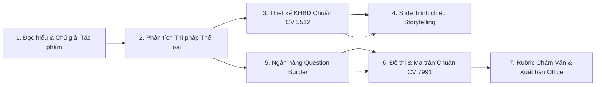
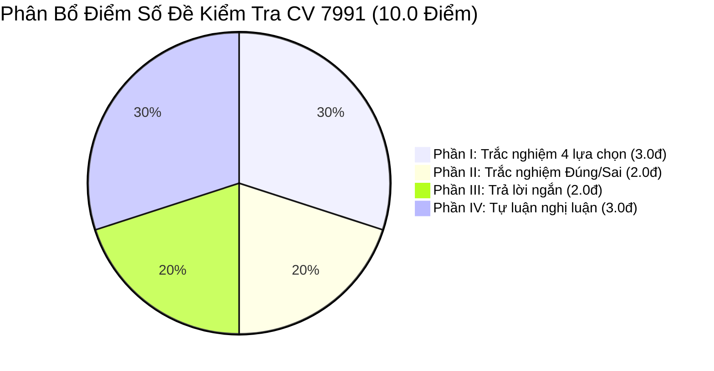
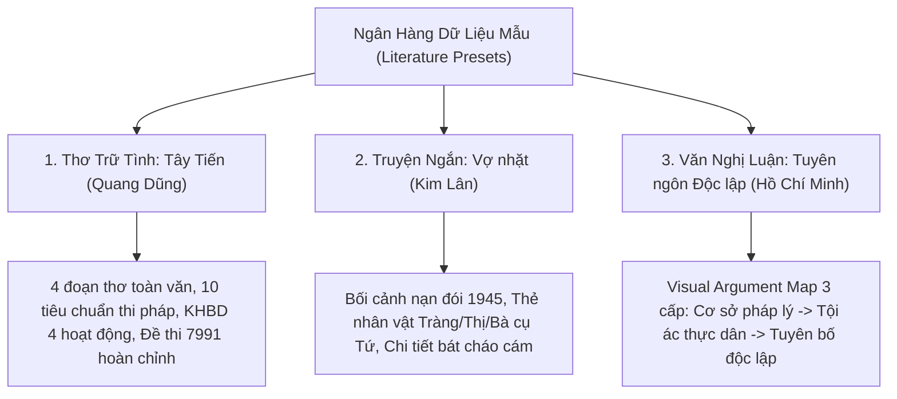

# TÀI LIỆU MÔ TẢ TỔNG QUAN TOÀN HỆ THỐNG
## EDUMASTER VN — TEACHING WORKSPACE NGỮ VĂN THPT & KHẢO THÍ CHUẨN CÔNG VĂN 5512 & 7991

---

## 1. GIỚI THIỆU TỔNG QUAN

### 1.1. Tên hệ thống & Sứ mệnh
**EduMaster VN** là Hệ thống Không gian Làm việc Sư phạm số (**Teaching Workspace**) chuyên sâu dành cho giáo viên môn Ngữ văn cấp Trung học phổ thông (THPT) tại Việt Nam.

Hệ thống được thiết kế nhằm số hóa và đồng bộ hóa toàn diện chu trình giảng dạy môn Ngữ văn theo định hướng phát triển phẩm chất, năng lực của **Chương trình Giáo dục Phổ thông 2018 (GDPT 2018)**. EduMaster VN giải quyết triệt để sự phân mảnh giữa việc đọc hiểu phân tích tác phẩm, thiết kế giáo án Kế hoạch bài dạy (KHBD), soạn thảo slide bài giảng trực quan, ngân hàng câu hỏi khảo thí, xây dựng đề thi chuẩn quy định và barem đánh giá năng lực học sinh.

### 1.2. Chu trình Sư phạm Liên thông Khép kín (End-to-End Workflow)
Khác với các ứng dụng soạn thảo văn bản hay tạo slide rời rạc, EduMaster VN vận hành theo mô hình chuỗi giá trị sư phạm liên thông 7 chặng:



### 1.3. Căn cứ Pháp lý & Quy chuẩn Chuyên môn
Hệ thống tuân thủ nghiêm ngặt hai văn bản chỉ đạo trọng tâm của Bộ Giáo dục và Đào tạo:
1. **Công văn số 5512/BGDĐT-GDTrH (ngày 18/12/2020)**: Hướng dẫn xây dựng và tổ chức thực hiện kế hoạch giáo dục của nhà trường, chuẩn hóa cấu trúc Kế hoạch bài dạy (KHBD) theo 4 hoạt động học và tiến trình 4 bước tổ chức dạy học của giáo viên.
2. **Công văn số 7991/BGDĐT-GDTrH (ngày 17/12/2024)**: Hướng dẫn xây dựng ma trận, bản đặc tả và đề kiểm tra định kỳ cấp THPT theo cấu trúc định dạng mới nhất từ năm học 2024 - 2025 (Đề thi 4 phần, bài toán trắc nghiệm Đúng/Sai lũy tiến 4 lệnh, câu trả lời ngắn và tự luận tích hợp).

---

## 2. KIẾN TRÚC HỆ THỐNG & CÔNG NGHỆ (TECHNICAL ARCHITECTURE)

### 2.1. Ngăn xếp Công nghệ (Tech Stack)

| Thành phần | Công nghệ sử dụng | Phiên bản | Vai trò & Đặc điểm kỹ thuật |
| :--- | :--- | :--- | :--- |
| **Giao diện (Frontend)** | React (TypeScript) | 19.0.1 | Xây dựng UI phản ứng nhanh, kiểu dữ liệu tĩnh nghiêm ngặt |
| **Công cụ đóng gói (Bundler)** | Vite | 8.3.0 | Môi trường phát triển HMR siêu tốc, tối ưu bundle production |
| **Tạo kiểu (Styling)** | Tailwind CSS | 4.3.3 | Thiết kế trực quan theo Utility-first, tùy biến visual tokens sư phạm |
| **Biểu tượng (Iconography)** | Lucide React | 0.546.0 | Bộ biểu tượng SVG hiện đại, ngữ nghĩa sư phạm rõ ràng |
| **Trạng thái (State)** | Centralized State | React Hooks | Quản lý trạng thái tập trung bất biến (`AppState`), hỗ trợ Serialize |
| **Office Export Engine** | Native Client Blob Engine | Pure TS/JS | Xuất file Word `.doc` (MIME MSOffice XML/HTML), Slide HTML, In A4 |
| **Mở rộng AI (AI Extension)** | `@google/genai` | 2.4.0 | Chuẩn bị tích hợp Server-side Gemini API hỗ trợ trợ lý sư phạm |

### 2.2. Sơ đồ Kiến trúc Thành phần Ứng dụng

```mermaid
graph TD
    subgraph UI_Shell ["Tầng Giao Diện & Điều Khiển (UI Shell)"]
        TopBar["Top Bar: Brand + Tác phẩm + Auto-save indicator + Quick Export"]
        Sidebar["Sidebar: 10 Modules Menu + Chuyển Tác phẩm + Footer Handover"]
    end

    subgraph State_Store ["Tầng Quản Lý Trạng Thái (Centralized State)"]
        AppState[("AppState Container")]
        CurrentLesson["Current Lesson Model"]
        KHBDState["LessonPlan5512 Model"]
        ExamState["Exam7991Data Model"]
        SlideState["SlideItem[] Model"]
        QuestionState["QuestionItem[] Model"]
        RubricState["RubricData Model"]
    end

    subgraph Core_Modules ["10 Phân Hệ Chức Năng Cốt Lõi"]
        M1["1. Teacher Dashboard"]
        M2["2. Literature Workspace (3 Cột)"]
        M3["3. Genre Analysis (Thơ/Truyện/Nghị luận)"]
        M4["4. Visual KHBD 5512 Builder"]
        M5["5. Question Builder"]
        M6["6. Rubric Builder 10 Điểm"]
        M7["7. Storytelling Slides Presentation"]
        M8["8. Đề thi 4 Phần Chuẩn CV 7991"]
        M9["9. Ma trận 2 Chiều & Bản Đặc tả"]
        M10["10. Export Suite & JSON Handover"]
    end

    subgraph Export_Layer ["Tầng Xuất Bản & Tích Hợp"]
        WordKHBD["Export Word KHBD (.doc)"]
        WordExam["Export Word Đề thi 7991 (.doc)"]
        WordRubric["Export Word Rubric (.doc)"]
        HtmlSlides["Export Standalone HTML Slide Deck"]
        PrintA4["Trình in A4 / Lưu PDF"]
        JsonBackup["JSON State Backup & Restore"]
    end

    UI_Shell --> Core_Modules
    Core_Modules <--> State_Store
    State_Store --> Export_Layer
```



### 2.3. Hệ thống Visual Tokens & Design System Sư phạm
Hệ thống loại bỏ hoàn toàn phong cách dashboard doanh nghiệp khô khan, định hình phong cách **Nhã nhặn — Học thuật — Đậm chất văn học**:
- **Bảng màu chủ đạo**:
  - `Canvas Paper` (`#FAF8F5`): Giấy ngà ấm áp, chống mỏi mắt cho giáo viên khi đọc các văn bản trường ca hoặc tiểu thuyết dài.
  - `Deep Burgundy` (`#7C2D37`): Đỏ rượu vang quý phái làm màu nhận diện EduMaster Văn, tiêu đề chính và nút hành động tác vụ.
  - `Ink Charcoal` (`#1C1817`): Màu đen mực mài truyền thống dùng cho thanh Sidebar, chế độ chiếu slide và code block.
  - `Warm Amber` (`#D97706`): Màu hổ phách ấm áp dành cho trích dẫn nghệ thuật, điểm nhấn câu thơ đắt giá.
- **Hệ thống 2+1 Typography**:
  - `Be Vietnam Pro`: Sans-serif sắc nét, hỗ trợ tiếng Việt tối ưu cho nhãn điều khiển, số liệu, bảng biểu.
  - `Lora`: Serif cổ điển, bay bổng dành riêng cho văn bản tác phẩm văn học, nhận định lý luận và trích đoạn.
  - `JetBrains Mono`: Monospace dùng hiển thị điểm số khảo thí, mã câu hỏi (`C1`, `C2`), JSON State.

---

## 3. CHI TIẾT 10 PHÂN HỆ CHỨC NĂNG (CORE SUBSYSTEMS)

### 3.1. Phân hệ 1: Bàn làm việc Giáo viên (Teacher Dashboard)
- **Mục tiêu**: Đóng vai trò trung tâm điều phối tổng thể buổi soạn bài của giáo viên.
- **Thành phần chức năng**:
  - **Banner Giáo viên**: Thể hiện thông tin cá nhân giáo viên (`Trầm Thị Đổi`), trường THPT, tổ bộ môn, các lớp được phân công giảng dạy (`12 Văn, 12A1`), học kỳ và năm học.
  - **Resume Spotlight ("Công việc đang làm")**: Thẻ tiêu điểm tác phẩm đang mở với tỷ lệ hoàn thành (Progress Bar %), thời gian lưu cuối và trạng thái sẵn sàng của KHBD / Slide / Đề thi.
  - **Lưới Quick Actions 6 nút**: Cho phép truy cập ngay lập tức vào từng khâu sư phạm mong muốn (Đọc hiểu văn bản, Phân tích thể loại, Soạn KHBD 5512, Tạo câu hỏi, Làm đề 7991, Soạn Slide).
  - **Lưới Tác phẩm gần đây (Recent Lessons Grid)**: Danh mục các bài giảng mẫu tích hợp sẵn, hiển thị thể loại, khối lớp, tác giả và tiến độ hoàn thành.

### 3.2. Phân hệ 2: Không gian Đọc & Chú giải Tác phẩm (Literature Workspace)
- **Mục tiêu**: Cung cấp môi trường đọc sâu, nghiên cứu văn bản trực tiếp với giao diện 3 cột chuyên nghiệp.
- **Cấu trúc 3 Cột**:
  - **Cột Trái (Outline & Chú thích)**: Cây phân đoạn tác phẩm, danh mục các điểm ghi chú/highlight đã tạo, có công cụ tìm kiếm và lọc chú thích.
  - **Cột Giữa (Document Reader)**: Toàn văn tác phẩm dàn trang theo chuẩn văn bản in ấn, font chữ `Lora` 18px thoáng đãng.
  - **Cột Phải (Bảng Phân tích Ngữ cảnh)**: 5 tab phân tích động (Chủ đề nội dung, Biện pháp tu từ nghệ thuật, Hệ thống hình ảnh trung tâm, Từ khóa nhãn tự, Mạch cảm xúc).
- **Floating Contextual Toolbar (Thanh công cụ nổi ngữ cảnh)**:
  - Khi bôi đen đoạn trích, thanh công cụ xuất hiện ngay trên dòng chữ cho phép:
    1. *Highlight*: Tô màu với 5 màu sắc sư phạm (Vàng, Lục, Lam, Tím, Đỏ).
    2. *Chú giải*: Thêm cảm thụ văn học, ý nghĩa hình tượng.
    3. *Nghệ thuật*: Gán nhãn biện pháp tu từ.
    4. *Tạo câu hỏi*: Bắn thẳng đoạn văn sang Question Builder làm ngữ liệu đọc hiểu.
    5. *Vào Slide*: Trích xuất tạo ngay một Quote Slide trình chiếu trang trọng.
    6. *Vào Đề thi*: Gán làm ngữ liệu trung tâm cho Đề kiểm tra 7991.
- **Reading Focus Mode**: Chế độ ẩn hoàn toàn hai thanh điều hướng hai bên, đưa trang văn bản về giữa màn hình với độ rộng `max-w-3xl`, biến màn hình thành trang sách văn học yên tĩnh tuyệt đối.

### 3.3. Phân hệ 3: Phân tích Thể loại Chuyên biệt (Genre Analysis)
Không áp đặt một khung phân tích cứng nhắc cho mọi bài đọc, hệ thống tự động nhận diện và chuyển đổi giao diện phân tích theo đúng thể loại:
1. **Thể loại THƠ (10 Tiêu chuẩn Thi pháp Thơ)**:
   - Chủ đề tư tưởng cốt lõi.
   - Hệ thống hình ảnh thơ (Hình ảnh thiên nhiên hoang sơ, hình ảnh người lính bi tráng).
   - Từ khóa thi pháp (nhãn tự).
   - Mạch cảm xúc & nhịp điệu bài thơ.
   - Giọng điệu chủ đạo và cách gieo vần.
   - Biện pháp tu từ đặc sắc (Ẩn dụ, nhân hóa, tương phản đối lập...).
   - Các câu thơ trọng tâm mang linh hồn tác phẩm.
   - Giá trị nội dung & Giá trị nghệ thuật khái quát.
2. **Thể loại TRUYỆN (Thi pháp Tác phẩm Văn xuôi)**:
   - Tình huống truyện độc đáo (Story Situation).
   - Điểm nhìn trần thuật & Người kể chuyện.
   - Thẻ Chân dung Nhân vật (Character Cards): Ngoại hình, lai lịch, biến chuyển tâm lý qua các chặng biến cố, dẫn chứng phát ngôn kinh điển.
   - Hệ thống chi tiết nghệ thuật đắt giá (Bát cháo cám, bát bánh đúc, lá cờ đỏ sao vàng...).
   - Thông điệp tư tưởng và chiều sâu nhân đạo của nhà văn.
3. **Thể loại VĂN NGHỊ LUẬN (Visual Argument Map)**:
   - Bản đồ phân nhánh lập luận hình cây trực quan:
     $$\text{Luận đề trung tâm} \longrightarrow \text{Hệ thống Luận điểm (Claims)} \longrightarrow \text{Lý lẽ sắc bén (Reasons)} \longrightarrow \text{Dẫn chứng thực tiễn (Evidences)} \longrightarrow \text{Kết luận (Conclusion)}$$
   - Hỗ trợ giáo viên chỉnh sửa động: Thêm/sửa/xóa luận điểm, bổ sung lý lẽ và gán trích dẫn đối sánh trực tiếp.

### 3.4. Phân hệ 4: Kế hoạch Bài dạy Chuẩn Công văn 5512 (Visual KHBD Builder)
- **Mục tiêu**: Xóa bỏ nỗi ám ảnh soạn giáo án thủ công, tạo lập KHBD chuẩn mực đúng cấu trúc văn bản của Bộ GD&ĐT.
- **Cấu trúc Dữ liệu Sư phạm 5512**:
  - **Phần I: Mục tiêu bài dạy**: Kiến thức, Năng lực chung (Tự chủ - Tự học, Giao tiếp - Hợp tác, Giải quyết vấn đề - Sáng tạo), Năng lực đặc thù Ngữ văn (Đọc, Viết, Nói và Nghe), Phẩm chất (Yêu nước, Nhân ái, Chăm chỉ, Trung thực, Trách nhiệm).
  - **Phần II: Thiết bị dạy học và học liệu**: Trang bị của Giáo viên & Học sinh.
  - **Phần III: Tiến trình dạy học (Timeline 4 Hoạt động)**:
    1. *Khởi động (Warm-up)*: Tạo tâm thế tiếp cận bài học.
    2. *Hình thành kiến thức mới (Knowledge Acquisition)*: Khám phá thi pháp và đọc hiểu chi tiết.
    3. *Luyện tập (Practice)*: Củng cố kỹ năng thông qua bài tập, câu hỏi.
    4. *Vận dụng (Application)*: Mở rộng thực tiễn, viết sáng tạo.
- **Chuẩn Hóa 4 Bước Tổ chức Thực hiện Trong Mỗi Hoạt Động**:
  - *Bước 1: Chuyển giao nhiệm vụ* (Giáo viên giao việc, học sinh tiếp nhận).
  - *Bước 2: Thực hiện nhiệm vụ* (Học sinh làm việc độc lập hoặc nhóm, giáo viên quan sát hỗ trợ).
  - *Bước 3: Báo cáo, thảo luận* (Đại diện trình bày, đối thoại, phản biện).
  - *Bước 4: Kết luận, nhận định* (Giáo viên chuẩn hóa kiến thức, chốt ghi bảng và đánh giá).
- **Tính năng nổi bật**:
  - Nút `Thành Slide`: Tự động trích xuất nội dung hoạt động sang một Slide thuyết trình.
  - Chuyển đổi giữa chế độ *Visual Builder* và chế độ *Văn bản in A4*.
  - Xuất file Word `.doc` theo mẫu hành chính chuẩn của Sở/Phòng GD&ĐT với đầy đủ khung ký duyệt Tổ trưởng chuyên môn và Giáo viên.

### 3.5. Phân hệ 5: Ngân hàng Câu hỏi Ngữ văn (Question Builder)
- **Mục tiêu**: Chuẩn hóa quy trình đặt câu hỏi kiểm tra đánh giá theo tiếp cận năng lực.
- **Quy trình 4 Bước Soạn Câu hỏi**:
  1. *Ngữ liệu tham chiếu* (Passage snippet trích từ tác phẩm hoặc văn bản mở rộng).
  2. *Lệnh câu hỏi* (Rõ ràng, tường minh theo từ khóa mức độ).
  3. *Đáp án gợi ý* (Chi tiết nội dung cần trả lời).
  4. *Hướng dẫn chấm & Biểu điểm* (Barem phân hóa rõ ràng).
- **Phân loại Đa chiều**:
  - *Dạng câu hỏi*: Đọc hiểu, Tiếng Việt / Thực hành tu từ, Nghị luận xã hội, Nghị luận văn học.
  - *Mức độ nhận thức*: Nhận biết (NB), Thông hiểu (TH), Vận dụng (VD).
  - *Kỹ năng đặc thù*: Nhận diện, Giải thích, Phân tích, So sánh, Đánh giá, Liên hệ, Sáng tạo.
- **Tính năng liên thông**: Nút `Vào Đề 7991` cho phép đẩy câu hỏi trực tiếp sang một trong 4 phần tương ứng của đề kiểm tra đang biên soạn.

### 3.6. Phân hệ 6: Rubric Builder Chấm Tự luận & Bài viết
- **Mục tiêu**: Xây dựng phiếu đánh giá theo tiêu chí (Rubric) cho các bài viết nghị luận xã hội và nghị luận văn học, khắc phục tính chủ quan khi chấm văn.
- **Các tiêu chí đánh giá chuẩn hóa**:
  1. Xác định vấn đề nghị luận (0.5 điểm).
  2. Bố cục và cấu trúc bài viết (1.0 điểm).
  3. Luận điểm và lập luận lí lẽ (2.0 điểm).
  4. Dẫn chứng và phân tích dẫn chứng (2.5 điểm).
  5. Cảm thụ văn học & Diễn đạt sáng tạo (2.0 điểm).
  6. Chính tả, dùng từ và ngữ pháp (1.0 điểm).
  7. Liên hệ thực tiễn mở rộng (1.0 điểm).
- **Tính năng thông minh**:
  - Tự động cộng dồn và cân bằng điểm số tổng chuẩn mực 10.0 điểm.
  - Phân tách 3 mức độ đạt: *Xuất sắc*, *Đạt*, *Cần cố gắng* kèm chỉ số hành vi cụ thể.
  - Xuất bảng Rubric ra định dạng Microsoft Word `.doc` phục vụ in phiếu chấm điểm cho học sinh.

### 3.7. Phân hệ 7: Slide Bài giảng Storytelling
- **Mục tiêu**: Tạo bài giảng điện tử sinh động, đậm chất nghệ thuật, tránh biến slide thành nơi sao chép văn bản bài dạy.
- **Các Layout Slide Chuyên biệt**:
  - `Cover Slide`: Mở đầu bài học sang trọng với thông tin tác phẩm, tác giả và mục tiêu.
  - `Quote Slide`: Trích dẫn thơ/văn chữ lớn in nghiêng trên nền đen mực mài, kèm câu hỏi gợi mở suy ngẫm cho lớp.
  - `Visual Map Slide`: Thể hiện sơ đồ phân nhánh lập luận, đường đi cảm xúc hoặc timeline sự kiện.
  - `Split Slide`: So sánh hai mặt đối lập của thi pháp (Ví dụ: Sự hiểm trở hoang vu của Tây Bắc >< Tâm hồn lãng mạn của người lính).
  - `Interactive Quiz Slide`: Câu hỏi khởi động/củng cố có phản hồi đáp án đúng và lời giải thích thi pháp học lập tức khi học sinh chọn.
  - `Cards Slide`: Bố cục lưới thẻ tóm tắt hệ thống nhân vật hoặc các chi tiết đặc sắc.
- **Speaker Notes**: Gợi ý sư phạm nằm dưới mỗi slide, hướng dẫn giáo viên cách dẫn dắt, đặt câu hỏi và quản lý thời lượng.
- **Fullscreen Presentation**: Trình chiếu toàn màn hình hỗ trợ bàn phím (`←`, `→`, `Space`, `Esc`).
- **Xuất bản**: Trích xuất bộ slide thành file HTML độc lập chứa toàn bộ styles và scripts, có thể mang đi trình chiếu trên mọi thiết bị máy tính giảng đường mà không cần cài đặt phần mềm phụ trợ.

### 3.8. Phân hệ 8: Đề Kiểm tra Định kỳ Chuẩn Công văn 7991
- **Mục tiêu**: Cung cấp đề kiểm tra Ngữ văn định kỳ chuẩn hóa cấu trúc mới nhất năm 2025.
- **Cấu trúc Đề thi 4 Phần Chuẩn (10.0 Điểm)**:



- **Chi tiết Từng Phần**:
  1. **Phần I (3.0 điểm)**: Gồm 12 câu trắc nghiệm nhiều phương án (mỗi câu 0.25đ). Thí sinh chọn 1 trong 4 đáp án A, B, C, D.
  2. **Phần II (2.0 điểm)**: Gồm 2 câu trắc nghiệm Đúng/Sai. Mỗi câu gồm 1 phần dẫn và đúng 4 phát biểu lệnh `a)`, `b)`, `c)`, `d)`.
     - *Tích hợp Bộ mô phỏng chấm điểm độc quyền CV 7991*:
       - Đúng 01 ý $\rightarrow$ nhận `0.10 điểm`.
       - Đúng 02 ý $\rightarrow$ nhận `0.25 điểm`.
       - Đúng 03 ý $\rightarrow$ nhận `0.50 điểm`.
       - Đúng cả 04 ý $\rightarrow$ nhận `1.00 điểm`.
  3. **Phần III (2.0 điểm)**: Gồm 4 câu trắc nghiệm trả lời ngắn (mỗi câu 0.50đ). Thí sinh điền câu trả lời súc tích.
  4. **Phần IV (3.0 điểm)**: 01 câu tự luận nghị luận có bảng barem chấm điểm từng bước rõ ràng.
- **Chế độ hiển thị song song**: Chuyển đổi giữa *Đề thi cho học sinh* và *Hướng dẫn chấm & Barem chi tiết cho giáo viên*.

### 3.9. Phân hệ 9: Ma trận 2 Chiều & Bản Đặc tả (Matrix View)
- **Mục tiêu**: Minh bạch hóa tính giá trị và độ tin cậy của đề kiểm tra theo chuẩn GDPT 2018.
- **Tỉ lệ Phân bổ Nhận thức Chuẩn**:
  - **Nhận biết**: $40\%$ ($4.0$ điểm)
  - **Thông hiểu**: $30\%$ ($3.0$ điểm)
  - **Vận dụng**: $30\%$ ($3.0$ điểm)
- **Bảng Đặc tả Đề kiểm tra**:
  - Gắn từng câu hỏi trong đề với **Yêu cầu cần đạt (YCCĐ)** theo chương trình GDPT 2018.
  - Phân rõ mạch kiến thức: Đọc hiểu văn bản văn học, Tiếng Việt thực hành, Viết bài văn nghị luận.
  - Cung cấp nút `In Ma trận A4` định dạng chuẩn để nộp Ban giám hiệu và Tổ chuyên môn duyệt đề.

### 3.10. Phân hệ 10: Trung tâm Xuất bản & Khối JSON Handover
- **Mục tiêu**: Đóng gói sản phẩm sư phạm thành tài liệu văn phòng chất lượng cao và bảo tồn toàn vẹn phiên làm việc.
- **Bảng Kiểm định 4 Tiêu chuẩn (Verification Checklist)**:
  - [x] Đầy đủ hệ sinh thái Ngữ văn THPT (Đọc hiểu, Thi pháp, KHBD, Slide, Khảo thí).
  - [x] Đề thi chuẩn Phần II Đúng/Sai 4 lệnh a-b-c-d kèm công thức lũy tiến CV 7991.
  - [x] Tích hợp bộ công cụ Xuất file Văn phòng (Word 5512, Word 7991, Rubric, HTML Slide).
  - [x] Khối JSON State bàn giao phiên làm việc không bị mất mát dữ liệu.
- **Bộ Công cụ Xuất bản Office Suite**:
  - `exportWordKHBD`: Xuất KHBD 5512 sang file `.doc` định dạng bảng chuẩn văn bản hành chính Việt Nam.
  - `exportWordExam7991`: Xuất Đề thi 7991 kèm Đáp án và Barem sang file `.doc`.
  - `exportRubricDoc`: Xuất tiêu chí chấm tự luận sang file `.doc`.
  - `exportHtmlSlides`: Xuất slide trình chiếu thành tệp HTML độc lập chạy offline.
- **JSON State Handover Engine**:
  - Mã hóa toàn bộ dữ liệu ứng dụng (`AppState`) thành chuỗi JSON tiêu chuẩn.
  - Chức năng **Sao chép 1-Click** và **Tải file JSON dự phòng**.
  - Chức năng **Khôi phục phiên làm việc (Restore Session)**: Giáo viên có thể dán mã JSON bất kỳ lúc nào để khôi phục toàn bộ tiến độ làm việc mà không cần cơ sở dữ liệu backend phức tạp.

---

## 4. DỮ LIỆU MẪU TÍCH HỢP SẴN (PRESET DATA REPOSITORY)

Hệ thống tích hợp sẵn 3 bài giảng tiêu biểu tương ứng với 3 thể loại văn học nền tảng của chương trình THPT:



1. **Tác phẩm Thơ: *Tây Tiến* — Quang Dũng (Lớp 12)**:
   - Toàn văn 4 đoạn với hệ thống chú thích và highlight mẫu.
   - Bảng phân tích thi pháp thơ: Cảm hứng lãng mạn và tinh thần bi tráng, hình tượng người lính vô danh, địa danh Tây Bắc hiểm trở.
   - Kế hoạch bài dạy 5512 hoàn chỉnh 4 hoạt động.
   - Đề thi 7991 đầy đủ 12 câu trắc nghiệm Phần I, 2 câu Đúng/Sai Phần II, 4 câu trả lời ngắn Phần III và câu tự luận Phần IV.
2. **Tác phẩm Truyện: *Vợ nhặt* — Kim Lân (Lớp 12)**:
   - Phân tích tình huống truyện "nhặt vợ" dở khóc dở cười giữa bờ vực cái chết của nạn đói 1945.
   - Hệ thống Character Cards chi tiết cho nhân vật Tràng, người vợ nhặt, bà cụ Tứ.
   - Barem phân tích các chi tiết đắt giá: Bát bánh đúc, nồi cháo cám, ánh mắt và giọt nước mắt của người mẹ nghèo.
3. **Tác phẩm Văn nghị luận: *Tuyên ngôn Độc lập* — Hồ Chí Minh (Lớp 12)**:
   - Cây sơ đồ lập luận trực quan (Visual Argument Map) 3 tầng: Cơ sở pháp lý & nhân đạo $\rightarrow$ Cơ sở thực tiễn (Tố cáo thực dân Pháp) $\rightarrow$ Tuyên bố độc lập và ý chí bảo vệ chủ quyền.

---

## 5. MÔ HÌNH DỮ LIỆU CỐT LÕI (CORE DATA MODELS)

Dưới đây là các giao diện dữ liệu chính định nghĩa kiến trúc trạng thái hệ thống:

```typescript
// Trạng thái tổng thể toàn ứng dụng
export interface AppState {
  version: string;
  lastUpdated: string;
  activeModule: ActiveModule;
  currentLessonId: string;
  lessons: LiteratureLesson[];
  khbd: LessonPlan5512;
  slides: SlideItem[];
  exam: Exam7991Data;
  questions: LiteratureQuestionItem[];
  rubric: RubricData;
  checklist: VerificationChecklist;
}

// Cấu trúc bài học Ngữ văn
export interface LiteratureLesson {
  id: string;
  title: string;
  author: string;
  authorBio: string;
  historicalContext: string;
  genre: 'poetry' | 'story' | 'argumentative' | 'essay';
  grade: string;
  textbook: string;
  fullText: string;
  textSections: { id: string; title: string; content: string }[];
  annotations: TextAnnotation[];
  poetryAnalysis?: PoetryAnalysis;
  storyAnalysis?: StoryAnalysis;
  argumentMap?: ArgumentMap;
  progress: number;
  lastModified: string;
  khbdStatus: 'ready' | 'draft';
  slideStatus: 'ready' | 'draft';
  examStatus: 'ready' | 'draft';
}

// Kế hoạch bài dạy chuẩn Công văn 5512
export interface LessonPlan5512 {
  info: AdministrativeInfo;
  objectives: LessonObjective;
  equipment: TeachingEquipment;
  activities: TeachingActivity[]; // 4 Hoạt động chuẩn
}

// Đề kiểm tra chuẩn Công văn 7991
export interface Exam7991Data {
  examHeader: { title: string; duration: string; examCode: string };
  passageRef?: string;
  partI: PartIChoiceQuestion[];          // 12 câu trắc nghiệm (3.0 đ)
  partII: PartIITrueFalseQuestion[];      // 2 câu Đúng/Sai 4 lệnh a-b-c-d (2.0 đ)
  partIII: PartIIIShortAnswerQuestion[];  // 4 câu trả lời ngắn (2.0 đ)
  partIV: PartIVEssayQuestion[];          // 1 câu tự luận nghị luận (3.0 đ)
}
```

---

## 6. HƯỚNG DẪN CÀI ĐẶT & VẬN HÀNH (GETTING STARTED)

### 6.1. Yêu cầu Môi trường
- **Node.js**: Phiên bản 18.0.0 trở lên (khuyến nghị Node 20 LTS).
- **Trình quản lý gói**: `npm` (đi kèm Node) hoặc `yarn` / `pnpm`.
- **Trình duyệt**: Google Chrome, Microsoft Edge, Safari, Firefox phiên bản hiện đại có hỗ trợ CSS modern tokens và Clipboard API.

### 6.2. Các Bước Cài đặt & Khởi chạy

```bash
# 1. Di chuyển vào thư mục dự án
cd "D:\Workspace\Other\Pj AI\HH"

# 2. Cài đặt các gói phụ thuộc
npm install

# 3. Chạy môi trường phát triển (Development Server)
npm run dev
```

Ứng dụng sẽ khởi chạy tại địa chỉ: `http://localhost:3000` (hoặc cổng hiển thị trên Terminal).

### 6.3. Đóng gói Ứng dụng (Build Production)

```bash
# Kiểm tra lỗi TypeScript không có lỗi biên dịch
npm run lint

# Đóng gói sản phẩm tĩnh tối ưu hóa vào thư mục dist
npm run build

# Xem thử bản đóng gói production
npm run preview
```

---

## 7. GIÁ TRỊ THỰC TIỄN & ĐỊNH HƯỚNG PHÁT TRIỂN

### 7.1. Giá trị Đối với Giáo viên và Nhà trường
1. **Tiết kiệm $70\%$ thời gian soạn bài**: Không còn phải gõ lại văn bản từ đầu, trích xuất đoạn thơ sang slide hoặc đề thi chỉ bằng 1 thao tác click chuột.
2. **Tuân thủ $100\%$ quy định của Bộ GD&ĐT**: Đảm bảo toàn bộ hồ sơ sư phạm từ KHBD đến Ma trận và Đề thi đều chuẩn chỉ theo CV 5512 và CV 7991, sẵn sàng cho công tác thanh kiểm tra chuyên môn.
3. **Chuẩn hóa công tác Khảo thí**: Thuật toán tính điểm trắc nghiệm Đúng/Sai lũy tiến giúp giáo viên ra đề chính xác, tránh nhầm lẫn barem điểm phức tạp của Bộ GD&ĐT.
4. **Bảo toàn dữ liệu linh hoạt**: Khối JSON Handover giúp giáo viên dễ dàng lưu trữ, trao đổi bài giảng với đồng nghiệp trong tổ bộ môn qua Zalo, Email, Google Drive mà không lo mất định dạng.

### 7.2. Định hướng Phát triển Nâng cấp (Roadmap)
- **Tích hợp Gemini 2.5/3 Pro Assistant**: Tự động gợi ý câu hỏi đọc hiểu 3 cấp độ từ ngữ liệu văn bản mới bất kỳ do giáo viên đưa vào.
- **Mở rộng Kho học liệu đám mây**: Chia sẻ thư viện đề thi và KHBD giữa các trường THPT trên toàn quốc.
- **Xuất bản PPTX gốc**: Nâng cấp module slide hỗ trợ xuất trực tiếp file Microsoft PowerPoint `.pptx` có hiệu ứng chuyển cảnh mượt mà.

---
*Tài liệu được biên soạn và chuẩn hóa phục vụ quản lý, phát triển và chuyển giao hệ thống EduMaster VN.*
